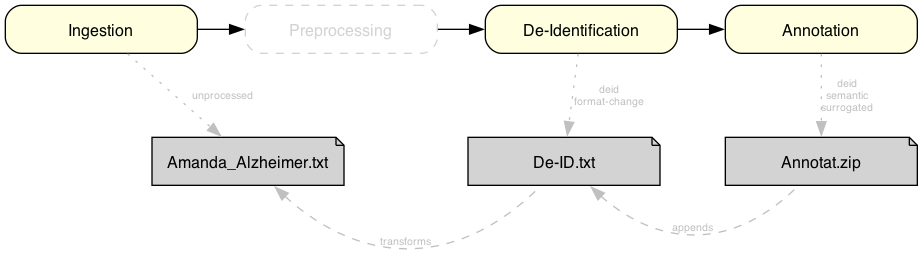

# Examples - MII IG Dokument v2026.0.1

* [**Table of Contents**](toc.md)
* **Examples**

## Examples

### Examples

The following example illustrates the processing of a **physician's discharge letter** of the patient **Amanda Alzheimer** by an NLP pipeline (see the figure). After ingestion of the original document `Amanda_Alzheimer.txt`, a document reference with the NLP processing status `unprocessed` is created. De-identification of the content then produces the result document `De-ID.txt`, so that it can be re-used for research purposes in a data-protection-compliant way. Its document reference carries the NLP processing status `de-identified` and points at the original document through `transforms`. Finally the clinical content is annotated, which may produce several result documents that can be combined into the archive `Annotat.zip`. Its document reference marks the NLP processing status as `de-identified, curated, annotated` and `appends` the document reference of the preceding NLP processing step.

The following FHIR resources represent the documents of the example:

* [Amanda_Alzheimer.txt](DocumentReference-AmandaAlzheimerOriginalDokument.md)
* [De-ID.txt](DocumentReference-AmandaAlzheimerDeIdentifiziertesDokument.md)
* [Annotat.zip](DocumentReference-AmandaAlzheimerAnnotiertesDokument.md)

The following FHIR resources are the patient and encounter resources belonging to the example. They are used only by the original document `Amanda_Alzheimer.txt` and its document reference.

* [Amanda Alzheimer](Patient-AmandaAlzheimer.md)
* [Einrichtungskontakt](Encounter-AmandaAlzheimerEinrichtungskontakt.md)
* [Abteilungskontakt](Encounter-AmandaAlzheimerAbteilungskontakt.md)
* [Versorgungsstellenkontakt](Encounter-AmandaAlzheimerVersorgungsstellenKontakt.md)

Source: [GraSCCo dataset, DOI (Zenodo): 10.5281/zenodo.6539130](https://doi.org/10.5281/zenodo.6539130)

All example instances of this guide are listed in the [Artifacts Summary](artifacts.md) and are linked individually there.

