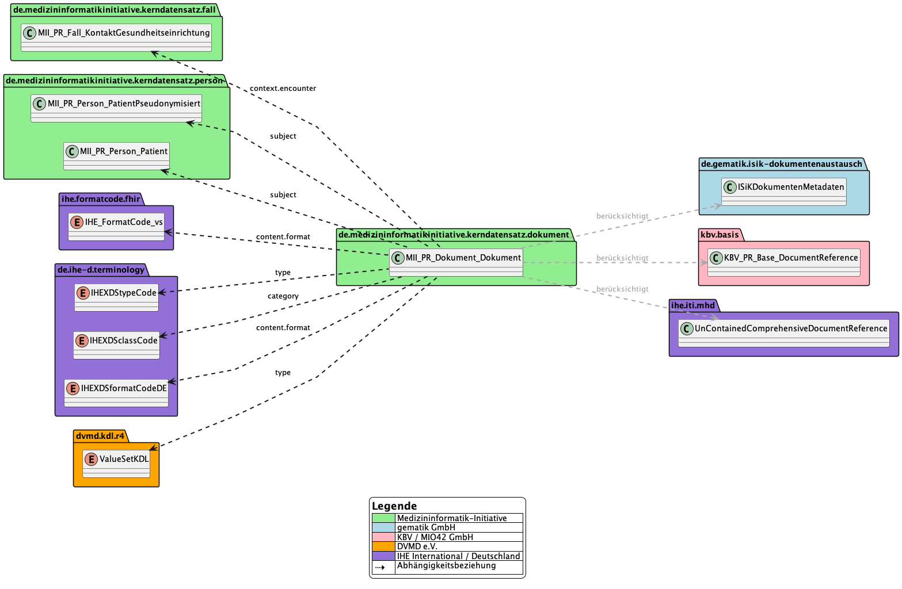

# Implementer Guidance - MII IG Dokument v2026.0.1

* [**Table of Contents**](toc.md)
* **Implementer Guidance**

## Implementer Guidance

### Guidance for implementers

#### Context within the overall project and references to other modules

Medical documents are decisive for comprehensive patient care, for the traceability of diagnoses and treatments, and for compliance with legal and scientific standards. They also play an important role in billing medical services and support efficient resource planning in the health system.

Both the technical and the content requirements of documentation in healthcare are highly dynamic. As a consequence, large differences in information structures have grown up between institutions. Archiving and discoverability in particular come with a high diversity of metadata.

In the context of the MII core datasets, the MII KDS module **Dokument** introduces an agreed national concept that is oriented towards common code systems and value sets and orchestrates an interoperable handling of medical documents.

##### Relation to other MII KDS modules

For certain data elements this module builds on existing work from other MII KDS modules, in order to harmonise and to increase compatibility. The dependencies on that work are described below.

| | | |
| :--- | :--- | :--- |
| [Person](https://simplifier.net/packages/de.medizininformatikinitiative.kerndatensatz.person) | The majority of medical documentation refers to patients. The MII KDS module Person is used to reference the connection from patient to document. In some cases the focus of the documentation is on medical objects, procedures or administrative acts. That is the only reason why the reference to the MII KDS module Person is marked optional. | Yes |
| [Fall](https://simplifier.net/packages/de.medizininformatikinitiative.kerndatensatz.fall) | Where the referenced document relates to a contact with a healthcare institution, the most appropriate contact level of the MII KDS module Fall should be referenced directly. That level typically depends on the document type. | No |

##### Use by other MII KDS modules

The basis of this MII KDS module is the [FHIR DocumentReference](https://www.hl7.org/fhir/documentreference.html). FHIR DocumentReferences are already used in other MII KDS modules. We recommend moving to the module specified here.

Where the specified document categories and types cannot adequately represent the requirements of a domain, the use of further domain-specific code systems and value sets is permitted.

| | | |
| :--- | :--- | :--- |
| [Consent](https://simplifier.net/packages/de.medizininformatikinitiative.kerndatensatz.consent) | The module references consent documents, e.g. in scanned form. An encounter relation is conceivable. | No |
| [Studie](https://simplifier.net/packages/de.medizininformatikinitiative.kerndatensatz.studie) | The module references study documents. Documents may also exist without a patient relation. | No |
| [Bildgebung](https://simplifier.net/packages/de.medizininformatikinitiative.kerndatensatz.bildgebung) | The module references documents as a substitute for structured diagnostic reports. | No |
| [Molgen Befund](https://simplifier.net/packages/de.medizininformatikinitiative.kerndatensatz.molgen) | The module references a range of document types which are, however, bound to existing standards. | No |
| [Meta](https://simplifier.net/packages/de.medizininformatikinitiative.kerndatensatz.meta) | The module extends numerous profiles with search parameter definitions - including for the MII KDS module Dokument. | No |

#### References

The MII KDS module Dokument is designed so that instances can be simultaneously compatible with the following FHIR-based standards:

* [KBV base profiles with Medical Information Objects (MIO)](https://simplifier.net/base1x0) - profile for referencing external or attached documents
* [Gematik Informationstechnische Systeme im Krankenhaus (ISiK) Dokumentenaustausch](https://simplifier.net/guide/isik-dokumentenaustausch-stufe-5) - profile representing the metadata required for document exchange
* [IHE Mobile access to Health Documents (MHD)](https://profiles.ihe.net/ITI/MHD) - profile for exchanging health documents through mobile applications, mobile devices or other resource-constrained and platform-constrained systems

This specification follows the FHIR core specification of the [DocumentReference resource](https://www.hl7.org/fhir/R4/documentreference.html#resource). The existing profiles of the [KBV base profiles](https://simplifier.net/base1x0), [Gematik ISiK](https://simplifier.net/guide/isik-dokumentenaustausch-stufe-5) and [IHE MHD](https://profiles.ihe.net/ITI/MHD) were taken into account during modelling with respect to freedom from contradiction. Note that compatibility from clinical routine towards the Dokument reference can be guaranteed, but backward compatibility into routine is not intended.

It is therefore possible to attribute resources such that they are simultaneously valid against MII KDS and against ISiK or IHE. ISiK and IHE modules are in principle compatible too; we nevertheless recommend stating both the `type` (from KDL / ISiK) and the `category` (from IHE), which neither of the two profiles offers at the same time.

A comparison of all data elements and of the terminology used was carried out and represented in the document profile ([Dokument: DocumentReference](profiles-and-extensions.md#dokument-documentreference)). The cardinalities are kept open, so no further or new restrictions were introduced in that respect. The terminology used in the compared profiles was taken up and represented in the document profile.

Person-related documents are always assigned to a person (MII KDS module Person) through `subject`. De-identified documents are marked accordingly through the security level (`securityLabel`). The data-holding institution is responsible for referencing only the correspondingly anonymised or pseudonymised variants of other MII modules. Wherever possible an encounter relation (MII KDS module Fall) is defined - if possible at the most relevant level of the encounter level model (`context.encounter`). In the package dependency diagram above, the relations between the MII modules are shown in green.

We recommend the [DVMD KDL standard](https://simplifier.net/KDL/), which ISiK also uses, for the precise type description (`type`), and the [IHE XDS class codes](https://art-decor.org/art-decor/decor-valuesets--ihede-?id=1.2.276.0.76.11.32&effectiveDate=2018-07-13T13:23:15&language=de-DE) for the coarser document category (`category`). [IHE XDS type and class codes can be derived unambiguously from KDL.](https://simplifier.net/kdl/~resources?category=ConceptMap) Further codings such as house codes, SNOMED CT or LOINC are optionally possible.

#### Compatibility

The compatibility of the FHIR DocumentReference profiles of MII KDS Dokument with the profiles from Gematik ISiK Dokumentenaustausch, KBV MIO Basis and IHE MHD was checked against the [FHIR Validator reports](https://medizininformatik-initiative.github.io/kerndatensatz-dokument/) and the technical profile properties. The focus is on cardinalities, Must Support (MS) markings and terminology bindings, because these are decisive for automated transformation and integration, for example in data integration centres.

##### Overview

-------

##### Detailed compatibility analysis

###### Cardinalities and Must Support

In the MII KDS Dokument profile most metadata elements are optional, including the central elements `type` and `category`. The cardinality of `type` is 0..1, of `category` 0..*, and MS is set. That means instances originating from less restrictive profiles such as KBV MIO Basis or IHE MHD can normally be taken over without adaptation, provided the metadata required for the respective application are present.

In the ISiK Dokumentenaustausch profile, by contrast, metadata elements such as `type`, `subject`, `securityLabel`, `content` and `context` are mandatory (cardinality 1..1) and marked MS. For a transformation from ISiK Dokumentenaustausch to MII KDS Dokument this is unproblematic, because all required information is present. In the other direction — a possible transformation from MII KDS Dokument to ISiK Dokumentenaustausch — missing mandatory elements would have to be supplied.

###### Terminology bindings

For the element `type` the MII KDS Dokument profile recommends KDL and XDS type codes, but explicitly also supports LOINC and SNOMED CT. The binding is extensible, so other code systems are permitted as well. The same applies to `category`: XDS codes are recommended, while LOINC and SNOMED CT are supported on equal terms. The binding strength is deliberately kept low in order to achieve maximum flexibility.

The ISiK Dokumentenaustausch profile specifies this differently: KDL and XDS codes are required for `type`, and the category is derived from the KDL code. Other code systems are not foreseen. The element `securityLabel` is likewise required and has to carry one of the prescribed codes.

In the KBV MIO Basis and IHE MHD profiles various code systems may be used, among them LOINC, SNOMED CT and XDS. Those profiles are therefore suited to international and cross-sector applications.

###### Further differences and commonalities

A further important difference concerns the handling of context elements such as `context.facilityType` and `context.practiceSetting`. In the MII KDS Dokument profile these elements are optional, in the ISiK Dokumentenaustausch profile mandatory. For the transformation from ISiK Dokumentenaustausch to MII KDS Dokument this is unproblematic, because all information is present. When transforming from KBV MIO Basis or IHE MHD to MII KDS Dokument these metadata elements may be missing, which is permitted given the flexibility of the target profile.

The metadata elements for document access (`content.attachment.data` and `content.attachment.url`) also differ in cardinality and MS marking. The MII KDS Dokument profile allows both variants and is therefore compatible with the differing approaches of the source profiles.

##### Conclusion and recommendations

The MII KDS Dokument profile is designed to offer a high degree of compatibility with the common German and international FHIR profiles for document metadata. The most important metadata elements are optional and support various code systems, among them KDL, XDS, LOINC and SNOMED CT. Transforming from ISiK Dokumentenaustausch to MII KDS Dokument requires no adaptation of the terminologies, because the ISiK requirements are stricter. When transforming from KBV MIO Basis or IHE MHD to MII KDS Dokument, the existing codes can be taken over provided they come from supported code systems. Missing mandatory elements are normally no problem in the target profile, because they are optional there.

In practice this means that an automated extract-transform-load (ETL) route from ISiK Dokumentenaustausch, KBV MIO Basis or IHE MHD to MII KDS Dokument is technically well feasible. The greatest challenge is harmonising the terminologies where necessary and making sure that all metadata relevant to the respective application are present. The flexibility of the MII KDS Dokument profile eases integration and promotes interoperability in the German and the international context.

-------

##### Technical overview

This section gives a structured overview of the compatibility of the MII KDS Dokument profile with the ISiK Dokumentenaustausch, KBV MIO Basis and IHE MHD profiles. For each comparison profile, motivation, compatibility and limitations are set out in detail.

##### ISiK Dokumentenaustausch

##### Motivation

Compatibility with ISiK Dokumentenaustausch is essential in order to guarantee cross-sector interoperability in the German health system. ISiK defines binding metadata standards for documents in hospitals. Harmonisation allows ISiK-conformant documents to be integrated smoothly into MII data integration centres and supports the implementation of national interoperability goals.

##### Compatibility

The MII KDS Dokument profile is designed as a superset of the ISiK profile and covers all ISiK requirements. The most important comparison points are:

| | | | |
| :--- | :--- | :--- | :--- |
| `status` | 1..1, Must Support | 1..1, Must Support | ✓ Fully compatible |
| `type` | 0..1, Must Support, extensible (KDL/XDS, LOINC, SNOMED CT) | 1..1, Must Support, required (KDL/XDS) | ✓ MII KDS Dokument supports the ISiK codes |
| `category` | 0..*, Must Support, extensible | 1..1, Must Support, derived from KDL | ✓ MII KDS Dokument supports the ISiK derivation |
| `subject` | 1..1, Must Support | 1..1, Must Support | ✓ Fully compatible |
| `content` | 1..*, Must Support | 1..1, Must Support | ✓ MII KDS Dokument allows several content entries |
| `securityLabel` | 0..*, extensible | 1..*, required | ⚠️ MII KDS Dokument makes security labels optional |
| `context` | 0..1 | 1..1, Must Support | ⚠️ MII KDS Dokument makes context optional |

Notes:

* **Must Support:** every ISiK Must-Support element is marked Must Support in the MII KDS Dokument profile as well.
* **Terminology:** MII supports every code ISiK makes mandatory and extends them with international code systems.

##### Limitations

* **Security labels:** optional in MII KDS Dokument, mandatory in ISiK. When transforming from MII to ISiK, security labels may have to be supplied.
* **Context:** ISiK requires context information, MII KDS Dokument leaves it optional. For ISiK compatibility, context data have to be supplied.
* **Category:** the ISiK-specific derivation of the category from KDL has to be observed when transforming.

##### KBV MIO Basis

##### Motivation

Compatibility with the KBV MIO Basis profile is decisive for integrating documents from ambulatory care and Medical Information Objects (MIOs) into the MII infrastructure. Harmonisation enables cross-sector exchange between ambulatory and inpatient care.

##### Compatibility

Both profiles are designed for flexibility and interoperability:

| | | | |
| :--- | :--- | :--- | :--- |
| `status` | 1..1, Must Support | 1..1 | ✓ Fully compatible |
| `type` | 0..1, Must Support, extensible | 0..1, preferred (LOINC, SNOMED CT, XDS) | ✓ Both support the same codes |
| `category` | 0..*, Must Support, extensible | 0..*, example binding | ✓ Fully compatible |
| `subject` | 1..1, Must Support | 0..1 | ✓ MII KDS Dokument makes it mandatory |
| `content` | 1..*, Must Support | 1..* | ✓ Fully compatible |
| `author` | 0..*, Must Support | 0..* | ✓ Fully compatible |
| `custodian` | 0..1 | 0..1 | ✓ Fully compatible |

Notes:

* **Terminology:** both profiles support LOINC, SNOMED CT and XDS.
* **Cardinalities:** largely compatible; the MII KDS Dokument profile is more restrictive on `subject`.

##### Limitations

* **Subject:** MII KDS Dokument requires a patient reference, KBV MIO Basis leaves it optional. When transforming from KBV MIO Basis to MII KDS Dokument a reference may have to be supplied.
* **Must Support:** MII KDS Dokument marks more elements as Must Support.
* **Other limitations:** no incompatibilities worth mentioning.

##### IHE MHD

##### Motivation

Compatibility with IHE MHD enables international interoperability and connection to globally established standards for document exchange. IHE MHD is the reference for FHIR-based document exchange in many countries.

##### Compatibility

The MII KDS Dokument profile is largely compatible with the IHE MHD Comprehensive profile, with differences in restrictiveness:

| | | | |
| :--- | :--- | :--- | :--- |
| `masterIdentifier` | 0..1 | 1..1 | ⚠️ IHE MHD requires a master identifier |
| `status` | 1..1, Must Support | 1..1 | ✓ Fully compatible |
| `type` | 0..1, Must Support, extensible | 1..1, preferred (LOINC) | ⚠️ IHE MHD requires a document type |
| `category` | 0..*, Must Support, extensible | 1..1, example binding | ⚠️ IHE MHD requires a category |
| `subject` | 1..1, Must Support | 1..1 | ✓ Fully compatible |
| `securityLabel` | 0..*, extensible | 1..*, extensible | ⚠️ IHE MHD requires security labels |
| `content.attachment` | 1..1, Must Support | 1..1 | ✓ Fully compatible |
| `context` | 0..1 | 1..1 | ⚠️ IHE MHD requires context |
| `content.format` | 0..1 | 1..1, preferred (IHE Format Codes) | ⚠️ IHE MHD requires a format code |

Notes:

* **Terminology:** both profiles support LOINC and international code systems.
* **Metadata:** IHE MHD requires more extensive metadata than MII KDS Dokument.

##### Limitations

* **Mandatory elements:** IHE MHD requires several elements that are optional in MII KDS Dokument (`masterIdentifier`, `type`, `category`, `securityLabel`, `context`, `content.format`).
* **Master identifier:** a unique master identifier has to be assigned for IHE MHD.
* **Format codes:** IHE MHD requires format codes, which may have to be supplied.
* **Context:** context information has to be provided for IHE MHD.
* **Security label:** at least one security label is required for IHE MHD.
* **Transformation note:** when transforming from MII KDS Dokument to IHE MHD, missing mandatory elements should be supplied. The reverse transformation is possible without loss of information.

##### Summary

The MII KDS Dokument profile is designed as a flexible superset and makes it possible to harmonise document metadata from different sources. Compatibility with ISiK and KBV MIO Basis is very high; with IHE MHD there is a need to adapt mandatory elements and metadata. Cross-sector and international interoperability is thereby assured.

**Compatibility overview:**

| | | |
| :--- | :--- | :--- |
| ISiK Dokumentenaustausch | Very high | Security label, context, category |
| KBV MIO Basis | Almost complete | Subject reference, Must-Support differences |
| IHE MHD | High, with adaptation | Mandatory elements (masterIdentifier, context) |

