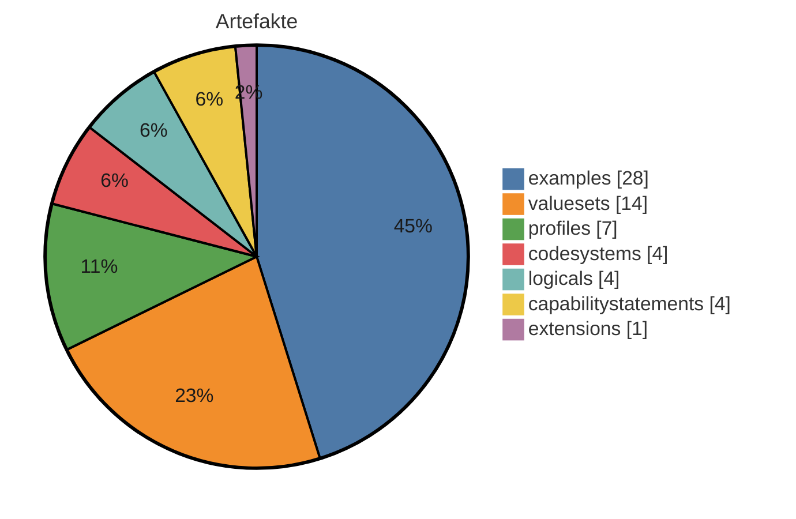
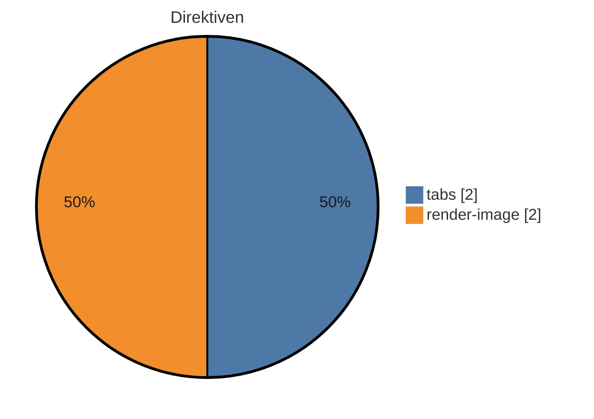

# IG-Statistik — basis

_Modus: `static` · Stand: 2026-07-31T19:53:12Z · Commit: `f6c6878`_

## Kennzahlen-Überblick

### Artefakte (Σ 62 publiziert)

_Hier wird gezählt, wie viele FHIR-Bausteine (Profile, Extensions, ValueSets usw.) der IG je Typ definiert._

| Typ | Anzahl |
|---|---|
| examples | 28 |
| valuesets | 14 |
| profiles | 7 |
| codesystems | 4 |
| logicals | 4 |
| capabilitystatements | 4 |
| extensions | 1 |

_Interne FSH-Konstrukte (nicht in Σ): 56 rulesets, 18 invariants, 5 mappings._

### Plattform-Direktiven — Σ 4 (unbekannt: 0)

_Dieser Abschnitt listet die plattformspezifischen Platzhalter in den Erklärseiten, die ein generischer IG Publisher nicht versteht und die daher umgesetzt werden müssen._

| Direktive | Anzahl |
|---|---|
| tabs | 2 |
| render-image | 2 |

## Inhaltsumfang & Repo-Hygiene

_Linguistische Kennzahlen zum Textumfang (Wörter je Seite, Durchschnitt) sowie Hinweise auf inhaltliche Dopplungen und nicht referenzierte Dateien (Dead-Code-Analogie) - hilft, Umfang und Aufräumpotenzial einzuschätzen._

| Kennzahl | Wert |
|---|---|
| Inhalts-Seiten | 22 |
| Wörter gesamt | 13655 |
| Ø Wörter / Seite | 620,7 |
| Median Wörter / Seite | 206 |
| kürzeste / längste Seite | 43 / 4099 Wörter |
| doppelte Inhaltsblöcke | 7 |
| identische Seiten (Gruppen) | 0 |
| Bilder nicht referenziert | 7 von 8 |
| Beispiele nicht in Narrativen | 28 von 28 |

_Heuristik: 'nicht referenziert' = Dateiname/Artefaktname kommt in keiner Erklärseite vor. Kein Beweis für Ungenutztheit (Referenz kann über Konfiguration/Build erfolgen)._

## Reife & Freigabe

_Verdichteter Reifegrad als Freigabe-Indikator: Status, Vollständigkeit der Dokumentation, Beispiel-Abdeckung der Profile und Governance-Reife._

| Komponente | Wert |
|---|---|
| **Reifegrad-Score** | **86/100 (reif)** |
| Status | active |
| Doku-Vollständigkeit (Inhalt vs. Stubs) | 100 % |
| Beispiel-Abdeckung Profile | 86 % (6/7) |
| Governance (CI · ig.ini · publication · devcontainer) | 75/100 |

**Profile ohne Beispiel (1):** `MII_PR_Fall_KontaktGesundheitseinrichtung`

## Strategie: Wiederverwendung, Lock-in & Zukunftssicherheit

_Strategische Kennzahlen: Bindung an die Quellplattform (Lock-in), Anteil standardisierter Terminologie, Wiederverwendung externer Bausteine und Zukunftssicherheit (FHIR-Version, Pflege-Aktivität)._

| Kennzahl | Wert |
|---|---|
| Hersteller-Lock-in | 2/100 (gering) · 0,2 Direktiven/Seite |
| Standard-Terminologie-Anteil | 99 % (SNOMED CT, LOINC, ICD-10, UCUM) |
| Wiederverwendung externer Profile (Parents) | 100 % (7 von 7 Profil-Parents extern; abstrakte LM-Basistypen ausgeschlossen) |
| FHIR-Version | R4 — aktuell verbreitet |
| Dependency-Veraltung | 0 veraltet (Heuristik) |
| Pflege-Kadenz | 10.0 Commits/Jahr · letzter Commit vor 9 Tagen |

_Lock-in und Standard-Terminologie-Anteil sind grobe Heuristiken aus Textvorkommen. Heuristik aus CalVer-Jahr; exakt nur via Package-Registry (extern)._

## Risiko & Compliance

_Entscheidungsrelevante Risiken für die Freigabe: Terminologie-Lizenzen, unterdrückte Warnungen, Datenschutz-Substanz, Wissenskonzentration (Bus-Faktor) und Kompatibilitätsbruch zur Vorversion._

| Risiko | Bewertung |
|---|---|
| Terminologie-Lizenz | Lizenzbedarf möglich — SNOMED CT: lizenzpflichtig (Affiliate/Land), LOINC: frei (Registrierung), ICD-10: frei, UCUM: frei |
| Unterdrückte QA-Warnungen | 8 (davon 0 breit) → gering |
| Datenschutz-Seite (Substanz) | fehlt/nur Stub (0 Wörter) |
| PII-artige Beispieldaten | ja – prüfen |
| Bus-Faktor (Wissenskonzentration) | 100 % Top-Autor → hoch |
| Breaking-Change-Risiko ggü. Vorversion | — (nur per Build/Vorversions-Diff) |

## Empfehlungen

_Hier stehen je Themenbereich konkrete, aus den Kennzahlen abgeleitete Schritte zur Verbesserung des IG._

| Bereich | Befund | Empfehlung |
|---|---|---|
| Artefakte (FSH) | 62 publiziert, FSH vorhanden | Liegen die Artefakte bereits als FSH vor, können sie unverändert nach input/fsh/ übernommen werden; ein Rückwandeln aus fertigen FHIR-Dateien entfällt. Wichtig: ids und Canonical-URLs bleiben gleich, damit bestehende Verweise weiter funktionieren (Bestandsschutz). |
| Narrative | 22 Inhalts-Seiten, Format target | Die frei geschriebenen Erklärseiten gehören als Markdown-Dateien nach input/pagecontent/. Reine Platzhalter-/Navigationsseiten werden nicht übernommen, da Navigation und Inhaltsverzeichnis automatisch entstehen. |
| Direktiven | 4 (0 unbekannt) | Plattformspezifische Platzhalter/Tags werden durch die passenden Mechanismen des IG Publishers ersetzt (meist Vorlagen-Includes oder normale Markdown-Konstrukte). Direktiven ohne bekanntes Gegenstück werden einzeln von Hand geprüft und sinnvoll übersetzt. |
| Dependencies | 4 (0 floating) | Alle deklarierten Paket-Abhängigkeiten werden mit fester Version in die sushi-config.yaml übernommen. Feste Versionen (Pinning) sind reproduzierbaren Builds vorzuziehen; bewegliche Einträge werden auf eine konkrete Version festgelegt. |
| Mehrsprachigkeit | FSH-Übersetzung ja, Supplements 0 | In Ressourcen eingebettete Übersetzungen werden vom Build automatisch in die jeweilige Sprachausgabe übernommen. Für übersetzte Erklärseiten legt man pro Sprache eigene Seiten an; eine Sprache bleibt führend, jede maschinelle Übersetzung ist menschlich zu prüfen. |
| Pflichtseiten | 10/11 im Zielformat | Das Standard-Seitenraster sollte vollständig vorhanden sein (z.B. Startseite, Anwendungsfälle, Datensätze, Konformität, Kontext, Referenzen, Änderungen, Downloads, Datenschutz, Übersetzungshinweis). Fehlende Zielseiten werden ergänzt und in die Seiten-/Menükonfiguration aufgenommen. |
| QC-Regeln | — definiert | Die im Quellprojekt definierten Qualitätsregeln (qc/custom.rules.yaml) werden übernommen und in der CI-Pipeline regelmäßig ausgeführt, damit Validierung und Namenskonventionen automatisch geprüft werden. |
| Metadaten/Config | id mii-ig-base, v2026.0.1 | Die Kerndaten des IG (id, Version, Status, Publisher, Lizenz) werden in sushi-config.yaml und ig.ini ins Zielformat überführt, inklusive Seiten-, Menü- und Sprachkonfiguration; die gewünschte Zielversion wird gesetzt. |
| Arbeitsweise | — | Änderungen entstehen isoliert auf einem eigenen Arbeitszweig, getrennt vom Hauptstand. Änderungen werden über einen Pull Request eingebracht und vor dem Zusammenführen menschlich geprüft, statt direkt auf den Hauptzweig zu schreiben. |

## Direktiven-Mapping (Detail)

_Dieser Abschnitt ordnet jedem Direktiven-Typ sein Gegenstück im IG-Publisher-Format zu, sortiert nach Häufigkeit._

| Direktive | Anzahl | Was es tut | Empfehlung (→ IG Publisher) |
|---|---|---|---|
| tabs | 2 | Gruppiert mehrere Inhalte (z.B. Darstellung, XML, JSON) in umschaltbare Reiter. | Die einzelnen Reiterinhalte durch die jeweils passenden generierten Anzeige-Fragmente (Struktur, XML, JSON) ersetzen; eine eigene Reiter-Mechanik ist meist nicht nötig. |
| render-image | 2 | Bindet ein Bild bzw. eine Grafik in die Seite ein. | Das Bild in das Bilderverzeichnis des Ziel-IG (input/images/) legen und über ein normales Markdown- oder HTML-Bild einbinden. |

# Anhang: Detailaufschlüsselung

_Im Anhang steht jeder Einzelwert mit seiner Quelle, damit man die Kennzahlen nachvollziehen kann, ohne im Projekt suchen zu müssen._

## Identität & Herkunft

| Feld | Wert | Quelle |
|---|---|---|
| id | mii-ig-base | sushi-config.yaml / package.json |
| canonical | https://www.medizininformatik-initiative.de/fhir/modul-base | sushi-config.yaml / package.json |
| packageId | de.medizininformatikinitiative.kerndatensatz.base | sushi-config.yaml / package.json |
| name | MII_IG_Base | sushi-config.yaml / package.json |
| title | MII Implementation Guide Core Dataset Base | sushi-config.yaml / package.json |
| version | 2026.0.1 | sushi-config.yaml / package.json |
| status | active | sushi-config.yaml / package.json |
| fhirVersion | 4.0.1 | sushi-config.yaml / package.json |
| license | CC-BY-4.0 | sushi-config.yaml / package.json |
| publisher | Medical Informatics Initiative (MII) | sushi-config.yaml / package.json |
| calver | True | version-Regex |

## Dependencies

_Die FHIR-Pakete, auf denen der IG aufbaut, samt Version und ob diese fest oder offen angegeben ist._

| Package | Version | Pin |
|---|---|---|
| de.basisprofil.r4 | 1.5.4 | gepinnt |
| de.medizininformatikinitiative.kerndatensatz.meta | 2026.0.0 | gepinnt |
| hl7.fhir.uv.xver-r5.r4 | 0.1.0 | gepinnt |
| hl7.fhir.uv.crmi | 2.0.0 | gepinnt |

## Artefakte (Quelle: input/fsh (FSH-Deklarationen))

_Jedes definierte Artefakt mit Typ, Name und Fundort in den Quelldateien._

| Typ | Name | InstanceOf | Quelle |
|---|---|---|---|
| Instance | mii-cps-person-capabilitystatement | CapabilityStatement | input/fsh/capabilitystatements/MII_CPS_Person_CapabilityStatement.fsh:1 |
| Instance | mii-cps-prozedur-capabilitystatement | CapabilityStatement | input/fsh/capabilitystatements/cps-mii-prozedur-capabilitystatement.fsh:1 |
| Instance | mii-cps-diagnose-capabilitystatement | CapabilityStatement | input/fsh/capabilitystatements/mii-cps-diagnose-capabilitystatement.fsh:1 |
| Instance | mii-cps-fall-capabilitystatement | CapabilityStatement | input/fsh/capabilitystatements/mii-cps-fall-capabilitystatement.fsh:1 |
| CodeSystem | MII_CS_Fall_SupplementActEncounterCode |  | input/fsh/codesystems/MII_CS_Fall_SupplementActEncounterCode.fsh:1 |
| CodeSystem | MII_CS_Fall_SupplementPatientClass |  | input/fsh/codesystems/MII_CS_Fall_SupplementPatientClass.fsh:1 |
| CodeSystem | MII_CS_Person_Vitalstatus |  | input/fsh/codesystems/MII_CS_Person_Vitalstatus.fsh:1 |
| CodeSystem | MII_CS_Diagnose_Lebensphase_Supplement_SNOMED |  | input/fsh/codesystems/mii-cs-diagnose-lebensphase-supplement-snomed.fsh:1 |
| Extension | MII_EX_Prozedur_Durchfuehrungsabsicht |  | input/fsh/extensions/MII_EX_Prozedur_Durchfuehrungsabsicht.fsh:1 |
| Instance | mii-exa-person-condition-todesursache | MII_PR_Person_Todesursache | input/fsh/instances/MII_EXA_Person_Condition_Todesursache.fsh:1 |
| Instance | mii-exa-person-patient-pseudonymisiert | MII_PR_Person_PatientPseudonymisiert | input/fsh/instances/MII_EXA_Person_Patient_Pseudonymisiert.fsh:1 |
| Instance | mii-exa-person-patient-1 | MII_PR_Person_Patient | input/fsh/instances/example-scenario.fsh:4 |
| Instance | mii-exa-fall-kontakt-gesundheitseinrichtung-8 | mii-pr-fall-kontakt-gesundheitseinrichtung | input/fsh/instances/example-scenario.fsh:64 |
| Instance | mii-exa-diagnose-mehrfachcodierung-primaercode | MII_PR_Diagnose_Condition | input/fsh/instances/example-scenario.fsh:86 |
| Instance | mii-exa-diagnose-mehrfachcodierung-sekundaercode | MII_PR_Diagnose_Condition | input/fsh/instances/example-scenario.fsh:113 |
| Instance | mii-exa-fall-kontakt-gesundheitseinrichtung-1 | mii-pr-fall-kontakt-gesundheitseinrichtung | input/fsh/instances/example-scenario.fsh:143 |
| Instance | mii-exa-fall-kontakt-gesundheitseinrichtung-9 | mii-pr-fall-kontakt-gesundheitseinrichtung | input/fsh/instances/example-scenario.fsh:170 |
| Instance | mii-exa-fall-kontakt-gesundheitseinrichtung-11 | mii-pr-fall-kontakt-gesundheitseinrichtung | input/fsh/instances/example-scenario.fsh:197 |
| Instance | mii-exa-person-observation-vitalstatus | MII_PR_Person_Vitalstatus | input/fsh/instances/example-scenario.fsh:225 |
| Instance | mii-exa-fall-kontakt-gesundheitseinrichtung-2 | mii-pr-fall-kontakt-gesundheitseinrichtung | input/fsh/instances/example-scenario.fsh:242 |
| Instance | mii-exa-diagnose-appendicitis | MII_PR_Diagnose_Condition | input/fsh/instances/example-scenario.fsh:274 |
| Instance | mii-exa-diagnose-condition-elbow-contusion | MII_PR_Diagnose_Condition | input/fsh/instances/example-scenario.fsh:295 |
| Instance | mii-exa-fall-kontakt-gesundheitseinrichtung-4 | mii-pr-fall-kontakt-gesundheitseinrichtung | input/fsh/instances/example-scenario.fsh:315 |
| Instance | mii-exa-prozedur-imaging | MII_PR_Prozedur_Procedure | input/fsh/instances/example-scenario.fsh:343 |
| Instance | mii-exa-fall-kontakt-gesundheitseinrichtung-5 | mii-pr-fall-kontakt-gesundheitseinrichtung | input/fsh/instances/example-scenario.fsh:366 |
| Instance | mii-exa-prozedur-procedure | MII_PR_Prozedur_Procedure | input/fsh/instances/example-scenario.fsh:395 |
| Instance | mii-exa-fall-kontakt-gesundheitseinrichtung-6 | mii-pr-fall-kontakt-gesundheitseinrichtung | input/fsh/instances/example-scenario.fsh:419 |
| Instance | mii-exa-fall-kontakt-gesundheitseinrichtung-10 | mii-pr-fall-kontakt-gesundheitseinrichtung | input/fsh/instances/example-scenario.fsh:447 |
| Instance | mii-exa-fall-kontakt-gesundheitseinrichtung-7 | mii-pr-fall-kontakt-gesundheitseinrichtung | input/fsh/instances/example-scenario.fsh:475 |
| Instance | mii-exa-diagnose-condition-multiple-codings | MII_PR_Diagnose_Condition | input/fsh/instances/example-scenario.fsh:507 |
| Instance | mii-exa-prozedur-procedure-2 | MII_PR_Prozedur_Procedure | input/fsh/instances/example-scenario.fsh:532 |
| Instance | mii-exa-person-observation-vitalstatus-discharge | MII_PR_Person_Vitalstatus | input/fsh/instances/example-scenario.fsh:554 |
| Instance | mii-exa-fall-kontakt-gesundheitseinrichtung-3 | mii-pr-fall-kontakt-gesundheitseinrichtung | input/fsh/instances/example-scenario.fsh:580 |
| RuleSet | AddBundleEntry |  | input/fsh/instances/mii-exa-base-test-data-bundle-1.fsh:1 |
| Instance | mii-exa-base-test-data-bundle-1 | Bundle | input/fsh/instances/mii-exa-base-test-data-bundle-1.fsh:10 |
| Instance | mii-exa-fall-kontakt-in-progress-status | mii-pr-fall-kontakt-gesundheitseinrichtung | input/fsh/instances/mii-exa-fall-kontakt-in-progress-status.fsh:1 |
| Instance | mii-exa-fall-kontakt-onleave-status | mii-pr-fall-kontakt-gesundheitseinrichtung | input/fsh/instances/mii-exa-fall-kontakt-onleave-status.fsh:1 |
| Instance | mii-exa-fall-kontakt-unknown-status | mii-pr-fall-kontakt-gesundheitseinrichtung | input/fsh/instances/mii-exa-fall-kontakt-unknown-status.fsh:1 |
| Invariant | GeburtsdatumRundenAufQuartal |  | input/fsh/invariants/GeburtsdatumRundenAufQuartal.fsh:1 |
| Invariant | PostleitzahlEinschraenkung |  | input/fsh/invariants/PostleitzahlEinschraenkung.fsh:1 |
| Invariant | TodesdatumKeineZeitangabe |  | input/fsh/invariants/TodesdatumKeineZeitangabe.fsh:1 |
| Invariant | ide-masked-1 |  | input/fsh/invariants/ide-masked-1.fsh:1 |
| Invariant | mii-enc-1 |  | input/fsh/invariants/mii-enc-1.fsh:1 |
| Invariant | mii-enc-2 |  | input/fsh/invariants/mii-enc-2.fsh:1 |
| Invariant | mii-enc-3 |  | input/fsh/invariants/mii-enc-3.fsh:1 |
| Invariant | mii-enc-4 |  | input/fsh/invariants/mii-enc-4.fsh:1 |
| Invariant | mii-enc-5 |  | input/fsh/invariants/mii-enc-5.fsh:1 |
| Invariant | mii-enc-6 |  | input/fsh/invariants/mii-enc-6.fsh:1 |
| Invariant | mii-enc-7 |  | input/fsh/invariants/mii-enc-7.fsh:1 |
| Invariant | mii-pat-1 |  | input/fsh/invariants/mii-pat-1.fsh:1 |
| Invariant | mii-pat-2 |  | input/fsh/invariants/mii-pat-2.fsh:1 |
| Invariant | pat-cnt-2or3-char |  | input/fsh/invariants/pat-cnt-2or3-char.fsh:1 |
| Invariant | pat-pseuded-1 |  | input/fsh/invariants/pat-pseuded-1.fsh:1 |
| Invariant | pat-pseuded-2 |  | input/fsh/invariants/pat-pseuded-2.fsh:1 |
| Invariant | proc-mii-1 |  | input/fsh/invariants/proc-mii-1.fsh:1 |
| Invariant | sct-ops-1 |  | input/fsh/invariants/sct-ops-1.fsh:1 |
| Logical | MII_LM_Diagnose |  | input/fsh/logicals/MII_LM_Diagnose.fsh:1 |
| Mapping | Diagnose-LogicalModel |  | input/fsh/logicals/MII_LM_Diagnose.fsh:52 |
| Logical | MII_LM_Fall |  | input/fsh/logicals/MII_LM_Fall.fsh:1 |
| Mapping | Fall-LogicalModel |  | input/fsh/logicals/MII_LM_Fall.fsh:50 |
| Logical | MII_LM_Person |  | input/fsh/logicals/MII_LM_Person_LogicalModel.fsh:1 |
| Mapping | Person-LogicalModel |  | input/fsh/logicals/MII_LM_Person_LogicalModel.fsh:132 |
| Logical | MII_LM_Prozedur |  | input/fsh/logicals/MII_LM_Prozedur.fsh:1 |
| Mapping | Prozedur-LogicalModel |  | input/fsh/logicals/MII_LM_Prozedur.fsh:36 |
| Profile | MII_PR_Diagnose_Condition |  | input/fsh/profiles/MII_PR_Diagnose_Condition.fsh:1 |
| Mapping | FHIR-LogicalModel |  | input/fsh/profiles/MII_PR_Diagnose_Condition.fsh:216 |
| Profile | MII_PR_Fall_KontaktGesundheitseinrichtung |  | input/fsh/profiles/MII_PR_Fall_KontaktGesundheitseinrichtung.fsh:1 |
| Profile | MII_PR_Person_Patient |  | input/fsh/profiles/MII_PR_Person_Patient.fsh:1 |
| Profile | MII_PR_Person_PatientPseudonymisiert |  | input/fsh/profiles/MII_PR_Person_PatientPseudonymisiert.fsh:1 |
| Profile | MII_PR_Person_Todesursache |  | input/fsh/profiles/MII_PR_Person_Todesursache.fsh:1 |
| Profile | MII_PR_Person_Vitalstatus |  | input/fsh/profiles/MII_PR_Person_Vitalstatus.fsh:1 |
| Profile | MII_PR_Prozedur_Procedure |  | input/fsh/profiles/MII_PR_Prozedur_Procedure.fsh:1 |
| RuleSet | SupportResource |  | input/fsh/rulesets/cps-rules.fsh:3 |
| RuleSet | Profile |  | input/fsh/rulesets/cps-rules.fsh:14 |
| RuleSet | SupportProfile |  | input/fsh/rulesets/cps-rules.fsh:19 |
| RuleSet | SupportInteraction |  | input/fsh/rulesets/cps-rules.fsh:25 |
| RuleSet | SupportSearchParam |  | input/fsh/rulesets/cps-rules.fsh:31 |
| RuleSet | SupportSpecialSearchParam |  | input/fsh/rulesets/cps-rules.fsh:39 |
| RuleSet | CRMIVersionPolicyStrict |  | input/fsh/rulesets/crmi.fsh:11 |
| RuleSet | CRMIVersionPolicyStrictInstance |  | input/fsh/rulesets/crmi.fsh:15 |
| RuleSet | CRMICopyrightLabel |  | input/fsh/rulesets/crmi.fsh:21 |
| RuleSet | CRMICopyrightLabelInstance |  | input/fsh/rulesets/crmi.fsh:25 |
| RuleSet | CRMIApprovalDate |  | input/fsh/rulesets/crmi.fsh:30 |
| RuleSet | CRMIApprovalDateInstance |  | input/fsh/rulesets/crmi.fsh:34 |
| RuleSet | CRMIArtifactTopic |  | input/fsh/rulesets/crmi.fsh:39 |
| RuleSet | CRMIArtifactTopicInstance |  | input/fsh/rulesets/crmi.fsh:43 |
| RuleSet | CRMIArtifactContributors |  | input/fsh/rulesets/crmi.fsh:48 |
| RuleSet | CRMIArtifactContributorsInstance |  | input/fsh/rulesets/crmi.fsh:71 |
| RuleSet | CRMIShareableStructureDefinition |  | input/fsh/rulesets/crmi.fsh:96 |
| RuleSet | CRMIPublishableStructureDefinition |  | input/fsh/rulesets/crmi.fsh:99 |
| RuleSet | CRMIKnowledgeCapabilitiesStructureDefinition |  | input/fsh/rulesets/crmi.fsh:102 |
| RuleSet | CRMIArtifactUsageLogicalModel |  | input/fsh/rulesets/crmi.fsh:108 |
| RuleSet | CRMIArtifactUsageProfile |  | input/fsh/rulesets/crmi.fsh:112 |
| RuleSet | CRMIArtifactUsageExtension |  | input/fsh/rulesets/crmi.fsh:116 |
| RuleSet | CRMIShareableCapabilityStatement |  | input/fsh/rulesets/crmi.fsh:122 |
| RuleSet | CRMIPublishableCapabilityStatement |  | input/fsh/rulesets/crmi.fsh:125 |
| RuleSet | CRMIKnowledgeCapabilitiesCapabilityStatement |  | input/fsh/rulesets/crmi.fsh:128 |
| RuleSet | CRMIArtifactUsageCapabilityStatement |  | input/fsh/rulesets/crmi.fsh:134 |
| RuleSet | CRMIShareableCodeSystem |  | input/fsh/rulesets/crmi.fsh:140 |
| RuleSet | CRMIPublishableCodeSystem |  | input/fsh/rulesets/crmi.fsh:143 |
| RuleSet | CRMIKnowledgeCapabilitiesCodeSystem |  | input/fsh/rulesets/crmi.fsh:146 |
| RuleSet | CRMIKnowledgeCapabilitiesCodeSystemPublishable |  | input/fsh/rulesets/crmi.fsh:152 |
| RuleSet | CRMIShareableValueSet |  | input/fsh/rulesets/crmi.fsh:158 |
| RuleSet | CRMIPublishableValueSet |  | input/fsh/rulesets/crmi.fsh:161 |
| RuleSet | CRMIComputableValueSet |  | input/fsh/rulesets/crmi.fsh:164 |
| RuleSet | CRMIKnowledgeCapabilitiesValueSet |  | input/fsh/rulesets/crmi.fsh:167 |
| RuleSet | ExtensionContext |  | input/fsh/rulesets/extension-context.fsh:1 |
| RuleSet | LicenseCodeableCCBY40 |  | input/fsh/rulesets/license-terms.fsh:3 |
| RuleSet | LicenseCodeableCCBY40Instance |  | input/fsh/rulesets/license-terms.fsh:7 |
| RuleSet | LicenseCodeableCC0 |  | input/fsh/rulesets/license-terms.fsh:11 |
| RuleSet | SnomedLicense |  | input/fsh/rulesets/license.fsh:1 |
| RuleSet | MetaProfile |  | input/fsh/rulesets/meta-profile.fsh:1 |
| RuleSet | Publisher |  | input/fsh/rulesets/publisher.fsh:1 |
| RuleSet | SP_Publisher |  | input/fsh/rulesets/publisher.fsh:6 |
| RuleSet | TestDataLabel |  | input/fsh/rulesets/test-data-label.fsh:3 |
| RuleSet | Translation |  | input/fsh/rulesets/translation.fsh:1 |
| RuleSet | AddSnomedCodingTranslation |  | input/fsh/rulesets/translation.fsh:8 |
| RuleSet | AddIcd10CodingTranslation |  | input/fsh/rulesets/translation.fsh:16 |
| RuleSet | AddAlphaIdCodingTranslation |  | input/fsh/rulesets/translation.fsh:24 |
| RuleSet | AddOrphaCodingTranslation |  | input/fsh/rulesets/translation.fsh:32 |
| RuleSet | AddOpsCodingTranslation |  | input/fsh/rulesets/translation.fsh:40 |
| RuleSet | Version |  | input/fsh/rulesets/version.fsh:2 |
| RuleSet | PR_CS_VS_Version |  | input/fsh/rulesets/version.fsh:7 |
| RuleSet | CRMIPackageSource |  | input/fsh/rulesets/version.fsh:16 |
| RuleSet | CRMIPackageSourceDefinitionalResource |  | input/fsh/rulesets/version.fsh:25 |
| RuleSet | CRMIResourceEffectivePeriod |  | input/fsh/rulesets/version.fsh:36 |
| RuleSet | CRMIResourceEffectivePeriodInstance |  | input/fsh/rulesets/version.fsh:40 |
| ValueSet | MII_VS_Diagnose_DiagnoseCodes_SNOMED |  | input/fsh/valuesets/MII_VS_Diagnose_DiagnoseCodes_SNOMED.fsh:1 |
| ValueSet | MII_VS_Fall_Diagnosis_Use |  | input/fsh/valuesets/MII_VS_Fall_DiagnosisUse.fsh:1 |
| ValueSet | MII_VS_Fall_IdentifierTypeCodes |  | input/fsh/valuesets/MII_VS_Fall_IdentifierTypeCodes.fsh:1 |
| ValueSet | MII_VS_Fall_LocationPhysicalType |  | input/fsh/valuesets/MII_VS_Fall_LocationPhysicalType.fsh:1 |
| ValueSet | MII_VS_Person_ICD10WHO |  | input/fsh/valuesets/MII_VS_Person_ICD10WHO.fsh:22 |
| ValueSet | MII_VS_Person_Vitalstatus |  | input/fsh/valuesets/MII_VS_Person_Vitalstatus.fsh:1 |
| ValueSet | MII_VS_Prozedur_Durchfuehrungsabsicht_SNOMEDCT |  | input/fsh/valuesets/MII_VS_Prozedur_Durchfuehrungsabsicht_SNOMED.fsh:1 |
| ValueSet | MII_VS_Prozedur_OpsKategorien_SNOMEDCT |  | input/fsh/valuesets/MII_VS_Prozedur_OpsKategorien_SNOMEDCT.fsh:1 |
| ValueSet | MII_VS_Prozedur_Prozeduren_SNOMEDCT |  | input/fsh/valuesets/MII_VS_Prozedur_Prozeduren_SNOMEDCT.fsh:1 |
| ValueSet | MII_VS_Diagnose_AlphaID |  | input/fsh/valuesets/mii-vs-diagnose-alphaid.fsh:1 |
| ValueSet | MII_VS_Diagnose_BodyStructure_SNOMED |  | input/fsh/valuesets/mii-vs-diagnose-bodysite-snomed.fsh:1 |
| ValueSet | MII_VS_Diagnose_ICD10GM |  | input/fsh/valuesets/mii-vs-diagnose-icd-10-gm.fsh:1 |
| ValueSet | MII_VS_Diagnose_Orphanet |  | input/fsh/valuesets/mii-vs-diagnose-orphanet.fsh:1 |
| ValueSet | MII_VS_Prozedur_OPS |  | input/fsh/valuesets/mii-vs-prozedur-ops.fsh:1 |

## Narrative-Seiten (22 Inhalt / 22 gesamt)

_Die Erklärseiten des IG mit Umfang und der Angabe, ob es sich um Inhalts- oder reine Platzhalterseiten handelt._

| Datei | Wörter | Format | Stub? |
|---|---|---|---|
| input/pagecontent/metadata.md | 4099 | target |  |
| input/pagecontent/changes.md | 2255 | target |  |
| input/pagecontent/general-requirements.md | 1645 | target |  |
| input/pagecontent/must-support.md | 1205 | target |  |
| input/pagecontent/terminology.md | 862 | target |  |
| input/pagecontent/missing-data.md | 631 | target |  |
| input/pagecontent/index.md | 482 | target |  |
| input/pagecontent/implementer-guidance.md | 297 | target |  |
| input/pagecontent/downloads.md | 273 | target |  |
| input/pagecontent/researcher-guidance.md | 216 | target |  |
| input/pagecontent/version-history.md | 210 | target |  |
| input/pagecontent/profiles-and-extensions.md | 202 | target |  |
| input/pagecontent/uml-diagrams.md | 187 | target |  |
| input/pagecontent/search-parameters-and-operations.md | 174 | target |  |
| input/pagecontent/capability-statements.md | 163 | target |  |
| input/pagecontent/datasets-and-descriptions.md | 144 | target |  |
| input/pagecontent/conformance.md | 126 | target |  |
| input/pagecontent/logical-models.md | 121 | target |  |
| input/pagecontent/ImplementationGuide-mii-ig-base.md | 110 | target |  |
| input/pagecontent/translationinfo.md | 109 | target |  |
| input/pagecontent/guidance.md | 101 | target |  |
| input/pagecontent/examples.md | 43 | target |  |

**Fehlende Pflichtseiten im Zielformat:** `security-and-privacy`

## Direktiven-Fundstellen

_Jede gefundene Direktive mit genauer Fundstelle und Originaltext zur weiteren Bearbeitung._

| Fundstelle | Direktive | Text (gekürzt) |
|---|---|---|
| input/pagecontent/general-requirements.md:27 | tabs | <table style="border-collapse: collapse; width: 100%;"> |
| input/pagecontent/general-requirements.md:72 | tabs | </table> |
| input/pagecontent/index.md:31 | render-image | 

## QC-Regeln (definiert; Quelle: —)

_Die im Projekt hinterlegten Qualitätsregeln; ihre Einhaltung wird erst beim Qualitätslauf des Builds geprüft._

_keine QC-Regeldatei gefunden_

## Mehrsprachigkeit

_Sprachkonfiguration und welche Übersetzungsmittel bereits vorhanden sind._

- Default-Sprache: `None` (Quelle: None) · konfigurierte Sprachen: ['init', 'progress', 'context', 'html', 'tx']
- Übersetzungs-Supplements: 0
- FSH-Translation-Extensions: ja
- Unterdrückte QA-Meldungen (`ignoreWarnings.txt`): 8

## Dopplungen & ungenutzte Dateien

_Konkrete Fundstellen doppelter Inhaltsblöcke sowie Listen nicht referenzierter Bilder und nicht eingebundener Beispiele._

| Doppelter Inhaltsblock (gekürzt) | Vorkommen |
|---|---|
| .uml diagram container svg { max width: 100%; height: auto !important; width: auto !import | input/pagecontent/uml-diagrams.md · input/pagecontent/uml-diagrams.md · input/pagecontent/uml-diagrams.md · input/pagecontent/uml-diagrams.md |
| the following logical models are defined for the mii core dataset base modules: | input/pagecontent/datasets-and-descriptions.md · input/pagecontent/logical-models.md |
| person module [person logical model](structuredefinition mii lm person.html) conceptual mo | input/pagecontent/datasets-and-descriptions.md · input/pagecontent/logical-models.md |
| treatment case module [treatment case logical model](structuredefinition mii lm fall.html) | input/pagecontent/datasets-and-descriptions.md · input/pagecontent/logical-models.md |
| diagnosis module [diagnosis logical model](structuredefinition mii lm diagnose.html) conce | input/pagecontent/datasets-and-descriptions.md · input/pagecontent/logical-models.md |
| procedure module [procedure logical model](structuredefinition mii lm prozedur.html) conce | input/pagecontent/datasets-and-descriptions.md · input/pagecontent/logical-models.md |
| for the corresponding fhir resource profiles that implement these logical models, see [pro | input/pagecontent/datasets-and-descriptions.md · input/pagecontent/logical-models.md |

**Nicht referenzierte Bilder (7):** `input/images-source/diagnose-uml.plantuml`, `input/images-source/fall-uml.plantuml`, `input/images-source/person-uml.plantuml`, `input/images-source/prozedur-uml.plantuml`, `input/images/2025-06-12_de_KDS-Abb_1.png`, `input/images/MII_Logo_engl_rgb.jpg`, `input/images/MII_Logo_rgb.jpg`

**Beispiele nicht in Narrativen eingebunden (28):** `mii-exa-person-condition-todesursache`, `mii-exa-person-patient-pseudonymisiert`, `mii-exa-person-patient-1`, `mii-exa-fall-kontakt-gesundheitseinrichtung-8`, `mii-exa-diagnose-mehrfachcodierung-primaercode`, `mii-exa-diagnose-mehrfachcodierung-sekundaercode`, `mii-exa-fall-kontakt-gesundheitseinrichtung-1`, `mii-exa-fall-kontakt-gesundheitseinrichtung-9`, `mii-exa-fall-kontakt-gesundheitseinrichtung-11`, `mii-exa-person-observation-vitalstatus`, `mii-exa-fall-kontakt-gesundheitseinrichtung-2`, `mii-exa-diagnose-appendicitis`, `mii-exa-diagnose-condition-elbow-contusion`, `mii-exa-fall-kontakt-gesundheitseinrichtung-4`, `mii-exa-prozedur-imaging`, `mii-exa-fall-kontakt-gesundheitseinrichtung-5`, `mii-exa-prozedur-procedure`, `mii-exa-fall-kontakt-gesundheitseinrichtung-6`, `mii-exa-fall-kontakt-gesundheitseinrichtung-10`, `mii-exa-fall-kontakt-gesundheitseinrichtung-7`, `mii-exa-diagnose-condition-multiple-codings`, `mii-exa-prozedur-procedure-2`, `mii-exa-person-observation-vitalstatus-discharge`, `mii-exa-fall-kontakt-gesundheitseinrichtung-3`, `mii-exa-base-test-data-bundle-1`, `mii-exa-fall-kontakt-in-progress-status`, `mii-exa-fall-kontakt-onleave-status`, `mii-exa-fall-kontakt-unknown-status`

# Anhang: Methodik & Metrik-Erklärung

_Beschreibung jeder im Report verwendeten Kennzahl - was sie misst und wie sie ermittelt wird - zur Nachvollziehbarkeit._

| Kennzahl | Was es misst | Herkunft / Berechnung |
|---|---|---|
| Artefakte (publiziert) | Anzahl der vom IG bereitgestellten FHIR-Konformitätsressourcen je Typ (Profile, Extensions, ValueSets, CodeSystems, Logical Models, CapabilityStatements, Beispiele). | Zählung der Deklarationen in input/fsh (bzw. generierten Ressourcen); interne FSH-Konstrukte (RuleSets/Invarianten/Mappings) separat, nicht im Total. |
| Plattform-/Simplifier-Direktiven | Vorkommen plattformspezifischer Platzhalter in den Erklärseiten, die ein generischer IG Publisher nicht versteht. | Mustererkennung je Direktiven-Typ in den Narrative-Seiten; nicht abgedeckte -> UNBEKANNT. |
| Linguistik (Wörter/Seite) | Textumfang der Inhalts-Seiten als Durchschnitt, Median und Extremwerte - Indikator für Dokumentations- und Übersetzungsumfang. | Wortzählung je Inhalts-Seite (ohne Stubs). |
| Inhaltliche Dopplungen | Identische Textabsätze (>= 12 Wörter) bzw. identische Seiten - Hinweis auf Redundanz/Aufräumpotenzial. | Hash-Vergleich normalisierter Absätze/Dateien. |
| Repo-Hygiene (ungenutzte Dateien) | Bilder/Beispiele, die in keiner Erklärseite referenziert sind (Dead-Code-Analogie). | Heuristik: Datei-/Artefaktname kommt im Seitentext nicht vor (kein Beweis für Ungenutztheit). |
| Reifegrad (Score) | Freigabe-Indikator 0-100 mit Band (in Entwicklung/fortgeschritten/technisch reif). | Mittelwert aus Status, Doku-Vollständigkeit (Inhalt vs. Stubs), Beispiel-Abdeckung der Profile und Governance-Reife. |
| Hersteller-Lock-in | Bindung an die Quellplattform durch proprietäre Direktiven (0-100, Band). | Grobe Heuristik aus Direktiven je Seite. |
| Standard-Terminologie-Anteil | Anteil standardisierter Terminologie (SNOMED/LOINC/ICD/UCUM) gegenüber Eigen-Terminologie. | Grobe Heuristik aus Textvorkommen der Standardsysteme vs. Anzahl lokaler CodeSystems. |
| Wiederverwendung externer Profile | Anteil der Profil-Parents, die auf externen Basisbausteinen statt eigenem Material beruhen. | FSH Parent:-Referenzen; abstrakte LM-Basistypen (Element/Base/...) ausgeschlossen. |
| FHIR-Versions-Aktualität | Wie aktuell die FHIR-Basis ist (R4/R4B/R5) - Zukunftssicherheit. | fhirVersion aus sushi-config, gegen bekannte Versionslinie eingeordnet. |
| Pflege-Kadenz | Lebendigkeit der Pflege (Commits/Jahr, Tage seit letztem Commit). | Git-Historie des analysierten Repos. |
| Bus-Faktor (Wissenskonzentration) | Schlüsselpersonen-Risiko: Anteil des Top-Autors an allen Commits. | Git-Historie, Autoren nach E-Mail gruppiert (Alias-robust). |
| Terminologie-Lizenz | Lizenz-/IP-Risiko gebundener Terminologien (z.B. SNOMED CT lizenzpflichtig). | Erkennung der Standardsysteme im FSH + hinterlegte Lizenzeinstufung. |
| Unterdrückte Warnungen | Risiko, dass ausgeblendete QA-Meldungen echte Fehler verbergen (breit/Wildcard vs. eng). | Klassifikation der Einträge in input/ignoreWarnings.txt. |
| Datenschutz-Substanz | Ob die Datenschutz-Seite substanziell ist und ob Beispiele PII-artige Daten enthalten. | Wortzahl der security-privacy-Seite + Heuristik (birthDate/name) in Beispielen. |
| Breaking-Change-Risiko | Kompatibilitätsbruch gegenüber der publizierten Vorversion. | Nur per Build/Vorversions-Diff ermittelbar - im statischen Modus nicht erhoben (null). |
| Statisch vs. Build | Erhebungsmodus jeder Kennzahl. | static = nur Quelldateien/Git; build = erfordert IG-Publisher-Lauf (qa.json); extern = Registry/Netz. Nicht statisch erhebbare Größen bleiben null und sind so markiert. |

# Anhang: Glossar

_Kurzerklärung der im Report verwendeten Fachbegriffe für Leser mit grundlegendem FHIR-Verständnis._

| Begriff | Erklärung |
|---|---|
| Artefakt | Ein einzelnes definiertes Element im IG, z.B. ein Profil, eine Extension, ein ValueSet oder ein Beispiel - die Bausteine, die der IG bereitstellt. |
| Beispiel (Example/Instance) | Eine konkrete, ausgefüllte FHIR-Ressource, die zeigt, wie ein Profil in der Praxis aussieht. |
| CalVer (Kalender-Versionierung) | Ein Versionsschema, das die Version aus dem Datum ableitet (z.B. Jahr.Nummer), statt fortlaufender Zählung. |
| Canonical-URL | Die weltweit eindeutige, dauerhafte Web-Adresse, mit der ein Artefakt offiziell identifiziert und referenziert wird. |
| CapabilityStatement | Eine Beschreibung, welche FHIR-Funktionen ein Server oder System unterstützt (welche Ressourcen, Operationen, Suchparameter). |
| CodeSystem | Eine Sammlung von Codes mit ihrer Bedeutung - die Quelle, aus der ein ValueSet seine Codes bezieht. |
| Default-Sprache | Die Hauptsprache des IG, in der die Inhalte primär verfasst und ausgeliefert werden (z.B. de-DE). |
| Dependency (Abhängigkeit) | Ein anderes FHIR-Paket, auf dessen Inhalte der IG aufbaut und das beim Bauen mitgeladen wird. |
| Direktive | Ein spezieller Platzhalter oder Tag in einer Seite, der zur Anzeige-Zeit durch generierten Inhalt ersetzt wird (z.B. ein eingebettetes Diagramm oder eine Tabelle). |
| Element-Wörterbuch (Dictionary) | Eine Tabelle, die alle Elemente eines Profils mit Beschreibung, Kardinalität und Datentyp auflistet. |
| Extension | Eine standardisierte Erweiterung, mit der man einer FHIR-Ressource zusätzliche Informationen hinzufügt, die der Basisstandard nicht vorsieht. |
| FHIR-Version | Die Version des FHIR-Standards, auf der der IG aufbaut (z.B. 4.0.1 = FHIR R4). |
| FQL (FHIR Query Language) | Eine Abfragesprache aus der Quellplattform, mit der Tabellen aus FHIR-Inhalten erzeugt werden - im generischen IG Publisher nicht verfügbar. |
| FSH (FHIR Shorthand) | Eine kompakte Textsprache, in der Profile, Extensions und andere FHIR-Artefakte geschrieben werden; ein Werkzeug übersetzt sie in die eigentlichen FHIR-Dateien. |
| FSH-Translation-Extension | Eine im FSH gesetzte Erweiterung, die übersetzte Textfassungen direkt in die Ressource einbettet; der Build kann daraus mehrsprachige Anzeigen erzeugen. |
| GoFSH | Das umgekehrte Werkzeug zu SUSHI: Es erzeugt aus vorhandenen FHIR-Dateien (JSON) FSH-Quellcode - nötig, wenn ein IG noch kein FSH besitzt. |
| Heuristische Schätzung | Eine näherungsweise, auf Erfahrungswerten beruhende Schätzung - kein exakter Wert, sondern eine Spanne. |
| id / packageId / name / title | Verschiedene Kennungen eines IG: id ist die technische Kurzbezeichnung, packageId der Paketname zur Auslieferung, name der maschinenlesbare Name, title der Anzeigetitel. |
| IG Publisher | Das offizielle Werkzeug von HL7, das aus den Quelldateien eines IG die fertige Webseite (HTML) und das Veröffentlichungspaket erzeugt. |
| ig.ini | Eine kleine Startkonfigurationsdatei, die dem IG Publisher grundlegende Bau-Einstellungen vorgibt. |
| Implementierungsleitfaden (IG) | Ein Dokumentenpaket, das beschreibt, wie ein FHIR-Standard für einen konkreten Anwendungsfall genau zu verwenden ist - mit Regeln, Beispielen und erklärendem Text. |
| Include (Vorlagen-Fragment) | Vorlagen-Mechanismus des IG Publishers: Mit einem Include-Befehl bindet man vorgefertigte HTML-Fragmente (z.B. die Strukturtabelle einer Ressource) in eine Seite ein. |
| Invariant | Eine zusätzliche Prüfregel (Bedingung), die eine Ressource erfüllen muss, um gültig zu sein. |
| Lizenz | Die Nutzungsbedingungen des IG; CC0-1.0 bedeutet Gemeinfreiheit, also freie Nutzung ohne Einschränkung. |
| Logical Model | Ein abstraktes Datenmodell, das Inhalte fachlich beschreibt, ohne direkt an einen FHIR-Ressourcentyp gebunden zu sein. |
| Mapping | Eine Zuordnung, die zeigt, wie Elemente eines Modells anderen Standards oder Modellen entsprechen. |
| Mehrsprachigkeit (i18n) | Fähigkeit eines IG, Inhalte in mehreren Sprachen bereitzustellen; eine Sprache ist führend/verbindlich. |
| Mermaid-Diagramm | Ein aus Textbeschreibung erzeugtes Diagramm (hier ein Tortendiagramm), das direkt in Markdown eingebettet wird. |
| Narrative-Seite | Eine frei geschriebene Erklärseite des IG (Fliesstext, meist Markdown), im Gegensatz zu den automatisch generierten Artefaktseiten. |
| Pflichtseiten | Ein festes Raster an Standardseiten (z.B. Startseite, Anwendungsfälle, Konformität, Änderungen), das ein vollständiger IG enthalten sollte. |
| Pinning (gepinnt/floating) | 'Gepinnt' heißt, eine Abhängigkeit ist auf eine feste Version festgelegt; 'floating' heißt, sie folgt automatisch der neuesten Version - was Builds weniger reproduzierbar macht. |
| Profile | Eine Einschränkung/Anpassung eines FHIR-Basistyps für einen bestimmten Zweck - legt fest, welche Felder Pflicht sind, welche Werte erlaubt sind usw. |
| Publisher | Die herausgebende Organisation, die für den IG verantwortlich zeichnet. |
| QA-Meldungen (Errors/Warnings/Hints) | Hinweise aus dem Build-Qualitätsbericht: Fehler verhindern eine saubere Veröffentlichung, Warnungen und Hinweise sind weniger kritisch. |
| QC-Regel (Qualitätsregel) | Eine formalisierte Prüfregel, die beim Qualitätslauf prüft, ob Ressourcen gültig sind und Konventionen (z.B. Namensschema) einhalten. |
| Quell-/Zielformat (source/target) | 'source' kennzeichnet Seiten im ursprünglichen Plattformformat, 'target' Seiten bereits im Format des Ziel-IG. |
| RuleSet | Ein wiederverwendbarer Block von FSH-Regeln, der in mehreren Artefakten eingebunden werden kann, um Wiederholungen zu vermeiden. |
| Snapshot / Differential | Zwei Sichten eines Profils: Differential zeigt nur die Änderungen gegenüber der Basis, Snapshot die vollständige Struktur mit allen Elementen. |
| statischer / full-Modus | Statisch heißt, es wird nur der Quellcode ausgewertet ohne den IG zu bauen; im full-Modus wird zusätzlich gebaut, um z.B. Validierungsfehler zu erfassen. |
| Status (draft/active) | Reifegrad eines IG oder Artefakts; 'draft' bedeutet Entwurf, noch nicht endgültig freigegeben. |
| Stub-Seite | Eine sehr kurze Seite (z.B. nur Navigation oder Platzhalter, unter 20 Wörtern), die keinen echten Inhalt trägt. |
| SUSHI | Das Werkzeug, das FSH-Dateien in fertige FHIR-Ressourcen (JSON) umwandelt. |
| sushi-config.yaml | Die zentrale Konfigurationsdatei eines FSH-basierten IG: enthält Kennungen, Version, Abhängigkeiten, Seiten- und Menüstruktur. |
| Unterdrückte Warnungen | Bewusst ausgeblendete QA-Meldungen, die als bekannt/akzeptiert gelten und den Bericht nicht stören sollen. |
| Validierung | Prüfung, ob eine FHIR-Ressource dem Standard und ihrem Profil entspricht. |
| ValueSet | Eine definierte Auswahl erlaubter Codes (Werteliste), die für ein bestimmtes Feld zulässig sind. |
| Übersetzungs-Supplement | Eine separate Datei, die übersetzte Texte zu einer Terminologie- oder Strukturressource liefert, ohne das Original zu verändern. |

