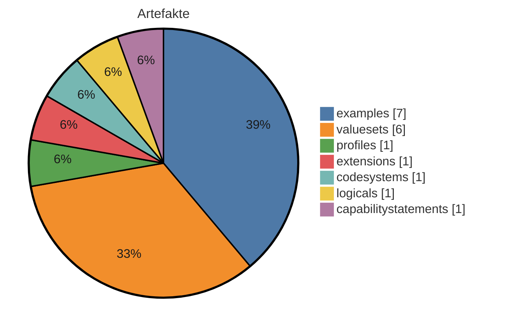
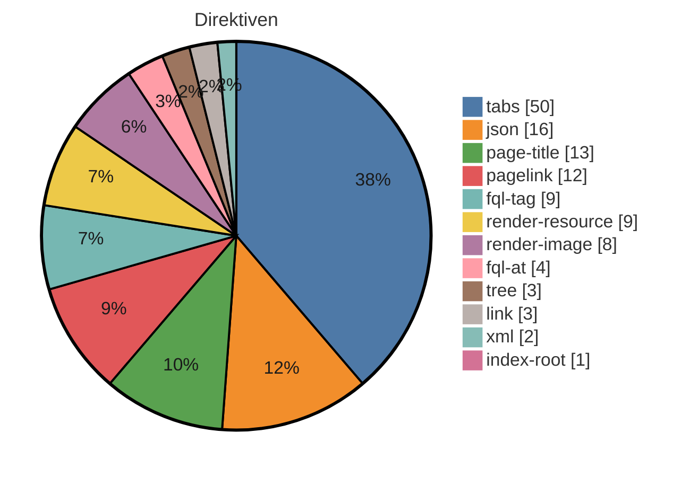

# IG-Statistik — dokument

_Modus: `static` · Stand: 2026-07-31T19:53:02Z · Commit: `9f76fed`_

## Kennzahlen-Überblick

### Artefakte (Σ 18 publiziert)

_Hier wird gezählt, wie viele FHIR-Bausteine (Profile, Extensions, ValueSets usw.) der IG je Typ definiert._

<div align="center">



</div>

<div align="center">

| Typ | Anzahl |
|---|---|
| examples | 7 |
| valuesets | 6 |
| profiles | 1 |
| extensions | 1 |
| codesystems | 1 |
| logicals | 1 |
| capabilitystatements | 1 |

</div>

_Interne FSH-Konstrukte (nicht in Σ): 27 rulesets, 2 invariants, 1 mappings._

### Plattform-Direktiven — Σ 130 (unbekannt: 0)

_Dieser Abschnitt listet die plattformspezifischen Platzhalter in den Erklärseiten, die ein generischer IG Publisher nicht versteht und die daher umgesetzt werden müssen._

<div align="center">



</div>

<div align="center">

| Direktive | Anzahl |
|---|---|
| tabs | 50 |
| json | 16 |
| page-title | 13 |
| pagelink | 12 |
| fql-tag | 9 |
| render-resource | 9 |
| render-image | 8 |
| fql-at | 4 |
| tree | 3 |
| link | 3 |
| xml | 2 |
| index-root | 1 |

</div>

## Inhaltsumfang & Repo-Hygiene

_Linguistische Kennzahlen zum Textumfang (Wörter je Seite, Durchschnitt) sowie Hinweise auf inhaltliche Dopplungen und nicht referenzierte Dateien (Dead-Code-Analogie) - hilft, Umfang und Aufräumpotenzial einzuschätzen._

<div align="center">

| Kennzahl | Wert |
|---|---|
| Inhalts-Seiten | 15 |
| Wörter gesamt | 7382 |
| Ø Wörter / Seite | 492,1 |
| Median Wörter / Seite | 391 |
| kürzeste / längste Seite | 59 / 1845 Wörter |
| doppelte Inhaltsblöcke | 3 |
| identische Seiten (Gruppen) | 0 |
| Bilder nicht referenziert | 1 von 6 |
| Beispiele nicht in Narrativen | 0 von 7 |

</div>

_Heuristik: 'nicht referenziert' = Dateiname/Artefaktname kommt in keiner Erklärseite vor. Kein Beweis für Ungenutztheit (Referenz kann über Konfiguration/Build erfolgen)._

## Reife & Freigabe

_Verdichteter Reifegrad als Freigabe-Indikator: Status, Vollständigkeit der Dokumentation, Beispiel-Abdeckung der Profile und Governance-Reife._

<div align="center">

| Komponente | Wert |
|---|---|
| **Reifegrad-Score** | **75/100 (technisch reif, Status Entwurf)** |
| Status | draft |
| Doku-Vollständigkeit (Inhalt vs. Stubs) | 79 % |
| Beispiel-Abdeckung Profile | 100 % (1/1) |
| Governance (CI · ig.ini · publication · devcontainer) | 75/100 |

</div>

## Strategie: Wiederverwendung, Lock-in & Zukunftssicherheit

_Strategische Kennzahlen: Bindung an die Quellplattform (Lock-in), Anteil standardisierter Terminologie, Wiederverwendung externer Bausteine und Zukunftssicherheit (FHIR-Version, Pflege-Aktivität)._

<div align="center">

| Kennzahl | Wert |
|---|---|
| Hersteller-Lock-in | 100/100 (hoch) · 8,7 Direktiven/Seite |
| Standard-Terminologie-Anteil | 97 % (SNOMED CT, LOINC) |
| Wiederverwendung externer Profile (Parents) | 100 % (1 von 1 Profil-Parents extern; abstrakte LM-Basistypen ausgeschlossen) |
| FHIR-Version | R4 — aktuell verbreitet |
| Dependency-Veraltung | 0 veraltet (Heuristik) |
| Pflege-Kadenz | 10.0 Commits/Jahr · letzter Commit vor 109 Tagen |

</div>

_Lock-in und Standard-Terminologie-Anteil sind grobe Heuristiken aus Textvorkommen. Heuristik aus CalVer-Jahr; exakt nur via Package-Registry (extern)._

## Risiko & Compliance

_Entscheidungsrelevante Risiken für die Freigabe: Terminologie-Lizenzen, unterdrückte Warnungen, Datenschutz-Substanz, Wissenskonzentration (Bus-Faktor) und Kompatibilitätsbruch zur Vorversion._

<div align="center">

| Risiko | Bewertung |
|---|---|
| Terminologie-Lizenz | Lizenzbedarf möglich — SNOMED CT: lizenzpflichtig (Affiliate/Land), LOINC: frei (Registrierung) |
| Unterdrückte QA-Warnungen | 66 (davon 0 breit) → gering |
| Datenschutz-Seite (Substanz) | fehlt/nur Stub (0 Wörter) |
| PII-artige Beispieldaten | keine erkannt |
| Bus-Faktor (Wissenskonzentration) | 100 % Top-Autor → hoch |
| Breaking-Change-Risiko ggü. Vorversion | — (nur per Build/Vorversions-Diff) |

</div>

## Empfehlungen

_Hier stehen je Themenbereich konkrete, aus den Kennzahlen abgeleitete Schritte zur Verbesserung des IG._

<div align="center">

| Bereich | Befund | Empfehlung |
|---|---|---|
| Artefakte (FSH) | 18 publiziert, FSH vorhanden | Liegen die Artefakte bereits als FSH vor, können sie unverändert nach input/fsh/ übernommen werden; ein Rückwandeln aus fertigen FHIR-Dateien entfällt. Wichtig: ids und Canonical-URLs bleiben gleich, damit bestehende Verweise weiter funktionieren (Bestandsschutz). |
| Narrative | 15 Inhalts-Seiten, Format source | Die frei geschriebenen Erklärseiten gehören als Markdown-Dateien nach input/pagecontent/. Reine Platzhalter-/Navigationsseiten werden nicht übernommen, da Navigation und Inhaltsverzeichnis automatisch entstehen. |
| Direktiven | 130 (0 unbekannt) | Plattformspezifische Platzhalter/Tags werden durch die passenden Mechanismen des IG Publishers ersetzt (meist Vorlagen-Includes oder normale Markdown-Konstrukte). Direktiven ohne bekanntes Gegenstück werden einzeln von Hand geprüft und sinnvoll übersetzt. |
| Dependencies | 5 (0 floating) | Alle deklarierten Paket-Abhängigkeiten werden mit fester Version in die sushi-config.yaml übernommen. Feste Versionen (Pinning) sind reproduzierbaren Builds vorzuziehen; bewegliche Einträge werden auf eine konkrete Version festgelegt. |
| Mehrsprachigkeit | FSH-Übersetzung ja, Supplements 0 | In Ressourcen eingebettete Übersetzungen werden vom Build automatisch in die jeweilige Sprachausgabe übernommen. Für übersetzte Erklärseiten legt man pro Sprache eigene Seiten an; eine Sprache bleibt führend, jede maschinelle Übersetzung ist menschlich zu prüfen. |
| Pflichtseiten | 1/11 im Zielformat | Das Standard-Seitenraster sollte vollständig vorhanden sein (z.B. Startseite, Anwendungsfälle, Datensätze, Konformität, Kontext, Referenzen, Änderungen, Downloads, Datenschutz, Übersetzungshinweis). Fehlende Zielseiten werden ergänzt und in die Seiten-/Menükonfiguration aufgenommen. |
| QC-Regeln | 8 definiert | Die im Quellprojekt definierten Qualitätsregeln (qc/custom.rules.yaml) werden übernommen und in der CI-Pipeline regelmäßig ausgeführt, damit Validierung und Namenskonventionen automatisch geprüft werden. |
| Metadaten/Config | id mii-ig-dokument, v2026.0.1 | Die Kerndaten des IG (id, Version, Status, Publisher, Lizenz) werden in sushi-config.yaml und ig.ini ins Zielformat überführt, inklusive Seiten-, Menü- und Sprachkonfiguration; die gewünschte Zielversion wird gesetzt. |
| Arbeitsweise | — | Änderungen entstehen isoliert auf einem eigenen Arbeitszweig, getrennt vom Hauptstand. Änderungen werden über einen Pull Request eingebracht und vor dem Zusammenführen menschlich geprüft, statt direkt auf den Hauptzweig zu schreiben. |

</div>

## Direktiven-Mapping (Detail)

_Dieser Abschnitt ordnet jedem Direktiven-Typ sein Gegenstück im IG-Publisher-Format zu, sortiert nach Häufigkeit._

<div align="center">

| Direktive | Anzahl | Was es tut | Empfehlung (→ IG Publisher) |
|---|---|---|---|
| tabs | 50 | Gruppiert mehrere Inhalte (z.B. Darstellung, XML, JSON) in umschaltbare Reiter. | Die einzelnen Reiterinhalte durch die jeweils passenden generierten Anzeige-Fragmente (Struktur, XML, JSON) ersetzen; eine eigene Reiter-Mechanik ist meist nicht nötig. |
| json | 16 | Zeigt eine Ressource oder ein Beispiel in JSON-Darstellung an. | Durch das vom IG Publisher erzeugte JSON-Anzeige-Fragment ersetzen. |
| page-title | 13 | Setzt an dieser Stelle den Titel der Seite, der aus den Seiteneinstellungen gezogen wird. | Entfällt ersatzlos - Seitentitel und Überschrift steuert man zentral über die Seiten- und Menükonfiguration. |
| pagelink | 12 | Erzeugt einen Verweis auf eine andere Seite oder ein Artefakt anhand eines Namens-Hinweises. | Durch einen normalen Markdown-Link auf die generierte Artefaktseite ersetzen (Form Typ-id.html); der Artefaktname wird in die kleingeschriebene id umgesetzt. |
| fql-tag | 9 | Öffnet einen Abfrageblock, der eine Tabelle aus FHIR-Inhalten erzeugt. | Bei Elementtabellen eines Profils durch das vorgefertigte Element-Wörterbuch-Fragment ersetzen; reine Metadaten (URL, Status, Version) entfallen (im generierten Kopfbereich vorhanden); sonst statische oder vorlagenbasierte Tabelle. |
| render-resource | 9 | Rendert eine vollständige FHIR-Ressource (z.B. ein CapabilityStatement) in die Seite hinein. | Meist entfernen, da der IG Publisher für jedes Artefakt automatisch eine eigene Seite erzeugt; alternativ das passende vorgefertigte Anzeige-Fragment einbinden. |
| render-image | 8 | Bindet ein Bild bzw. eine Grafik in die Seite ein. | Das Bild in das Bilderverzeichnis des Ziel-IG (input/images/) legen und über ein normales Markdown- oder HTML-Bild einbinden. |
| fql-at | 4 | Markiert einen Abfrage-Codeblock in besonderer Schreibweise (mit @-Präfix). | Wie einen normalen Abfrageblock behandeln und durch ein generiertes Tabellen-Fragment oder eine statische Tabelle ersetzen. |
| tree | 3 | Zeigt die Struktur eines Profils/einer Extension als aufklappbaren Strukturbaum an. | Durch das vom IG Publisher erzeugte Struktur-Fragment ersetzen (Snapshot- oder Differential-Ansicht bzw. Element-Wörterbuch). |
| link | 3 | Erzeugt einen Verweis auf ein einzelnes Artefakt (z.B. dessen Übersichtsseite). | Durch einen normalen Markdown-Link auf die generierte Artefaktseite ersetzen (Form Typ-id.html). |
| xml | 2 | Zeigt eine Ressource oder ein Beispiel in XML-Darstellung an. | Durch das vom IG Publisher erzeugte XML-Anzeige-Fragment ersetzen. |
| index-root | 1 | Erzeugt an dieser Stelle ein automatisches Inhaltsverzeichnis bzw. die Wurzel der Navigationsstruktur. | Entfällt - Navigation und Inhaltsverzeichnis erzeugt der IG Publisher selbst aus der konfigurierten Seitenstruktur. |

</div>

# Anhang: Detailaufschlüsselung

_Im Anhang steht jeder Einzelwert mit seiner Quelle, damit man die Kennzahlen nachvollziehen kann, ohne im Projekt suchen zu müssen._

## Identität & Herkunft

<div align="center">

| Feld | Wert | Quelle |
|---|---|---|
| id | mii-ig-dokument | sushi-config.yaml / package.json |
| canonical | https://www.medizininformatik-initiative.de/fhir/ext/modul-dokument | sushi-config.yaml / package.json |
| packageId | de.medizininformatikinitiative.kerndatensatz.dokument | sushi-config.yaml / package.json |
| name | MII_IG_Dokument | sushi-config.yaml / package.json |
| title | MII IG Dokument | sushi-config.yaml / package.json |
| version | 2026.0.1 | sushi-config.yaml / package.json |
| status | draft | sushi-config.yaml / package.json |
| fhirVersion | 4.0.1 | sushi-config.yaml / package.json |
| license | CC0-1.0 | sushi-config.yaml / package.json |
| publisher | Medizininformatik-Initiative | sushi-config.yaml / package.json |
| calver | True | version-Regex |

</div>

## Dependencies

_Die FHIR-Pakete, auf denen der IG aufbaut, samt Version und ob diese fest oder offen angegeben ist._

<div align="center">

| Package | Version | Pin |
|---|---|---|
| de.ihe-d.terminology | 3.0.1 | gepinnt |
| de.medizininformatikinitiative.kerndatensatz.base | 2026.0.0 | gepinnt |
| de.medizininformatikinitiative.kerndatensatz.meta | 2026.0.0 | gepinnt |
| dvmd.kdl.r4 | 2025.0.1 | gepinnt |
| ihe.formatcode.fhir | 1.4.0 | gepinnt |

</div>

## Artefakte (Quelle: input/fsh (FSH-Deklarationen))

_Jedes definierte Artefakt mit Typ, Name und Fundort in den Quelldateien._

<div align="center">

| Typ | Name | InstanceOf | Quelle |
|---|---|---|---|
| RuleSet | Header |  | input/fsh/common/Header.fsh:1 |
| RuleSet | PR_Header |  | input/fsh/common/Header.fsh:5 |
| RuleSet | EX_Header |  | input/fsh/common/Header.fsh:10 |
| RuleSet | CS_Header |  | input/fsh/common/Header.fsh:15 |
| RuleSet | VS_Header |  | input/fsh/common/Header.fsh:19 |
| RuleSet | LM_Header |  | input/fsh/common/Header.fsh:23 |
| RuleSet | Meta |  | input/fsh/common/Meta.fsh:1 |
| RuleSet | CS_VS_Meta |  | input/fsh/common/Meta.fsh:5 |
| RuleSet | CS_Meta |  | input/fsh/common/Meta.fsh:11 |
| RuleSet | VS_Meta |  | input/fsh/common/Meta.fsh:17 |
| RuleSet | EX_Meta |  | input/fsh/common/Meta.fsh:21 |
| RuleSet | LM_Meta |  | input/fsh/common/Meta.fsh:24 |
| RuleSet | Publisher |  | input/fsh/common/Publisher.fsh:1 |
| RuleSet | SP_Publisher |  | input/fsh/common/Publisher.fsh:6 |
| RuleSet | Status |  | input/fsh/common/Status.fsh:1 |
| RuleSet | Version |  | input/fsh/common/Version.fsh:1 |
| RuleSet | PR_CS_VS_Version |  | input/fsh/common/Version.fsh:4 |
| RuleSet | SupportResource |  | input/fsh/common/rulesets.fsh:1 |
| RuleSet | Profile |  | input/fsh/common/rulesets.fsh:6 |
| RuleSet | SupportProfile |  | input/fsh/common/rulesets.fsh:11 |
| RuleSet | SupportInteraction |  | input/fsh/common/rulesets.fsh:16 |
| RuleSet | SupportSearchParam |  | input/fsh/common/rulesets.fsh:21 |
| RuleSet | Description |  | input/fsh/common/rulesets.fsh:28 |
| RuleSet | DescriptionIntl |  | input/fsh/common/rulesets.fsh:32 |
| RuleSet | CommentedDescription |  | input/fsh/common/rulesets.fsh:36 |
| RuleSet | CommentedDescriptionIntl |  | input/fsh/common/rulesets.fsh:41 |
| RuleSet | Translation |  | input/fsh/common/rulesets.fsh:46 |
| Instance | mii-cps-dokument-capabilitystatement | CapabilityStatement | input/fsh/definitions/mii-cps-dokument-capabilitystatement.fsh:1 |
| Instance | AmandaAlzheimerAnnotiertesDokument | MII_PR_Dokument_Dokument | input/fsh/examples/alzheimer/mii-exa-dokument-document-nlp-annotiert.fsh:1 |
| Instance | AmandaAlzheimerDeIdentifiziertesDokument | MII_PR_Dokument_Dokument | input/fsh/examples/alzheimer/mii-exa-dokument-document-nlp-de-identifiziert.fsh:1 |
| Instance | AmandaAlzheimerOriginalDokument | MII_PR_Dokument_Dokument | input/fsh/examples/alzheimer/mii-exa-dokument-document-nlp-original.fsh:1 |
| Instance | AmandaAlzheimerAbteilungskontakt | MII_PR_Fall_KontaktGesundheitseinrichtung | input/fsh/examples/alzheimer/mii-exa-dokument-encounter-abteilungskontakt.fsh:1 |
| Instance | AmandaAlzheimerEinrichtungskontakt | MII_PR_Fall_KontaktGesundheitseinrichtung | input/fsh/examples/alzheimer/mii-exa-dokument-encounter-einrichtungskontakt.fsh:1 |
| Instance | AmandaAlzheimerVersorgungsstellenKontakt | MII_PR_Fall_KontaktGesundheitseinrichtung | input/fsh/examples/alzheimer/mii-exa-dokument-encounter-versorgungstellenkontakt.fsh:1 |
| Instance | AmandaAlzheimer | MII_PR_Person_Patient | input/fsh/examples/alzheimer/mii-exa-dokument-patient-alzheimer.fsh:1 |
| Extension | MII_EX_Dokument_NLP_Processing_Status |  | input/fsh/extensions/mii-ex-dokument-nlp-processing-status.fsh:1 |
| Logical | MII_LM_Dokument |  | input/fsh/logical-model/mii-lm-dokument.fsh:1 |
| Mapping | MII_MAP_Dokument |  | input/fsh/logical-model/mii-map-dokument.fsh:1 |
| Invariant | mii-iv-dokument-dokument-category |  | input/fsh/profiles/mii-iv-dokument-dokument-category.fsh:1 |
| Invariant | mii-iv-dokument-dokument-type |  | input/fsh/profiles/mii-iv-dokument-dokument-type.fsh:1 |
| Profile | MII_PR_Dokument_Dokument |  | input/fsh/profiles/mii-pr-dokument-dokument.fsh:5 |
| CodeSystem | MII_CS_Dokument_NLP_Processing_Status |  | input/fsh/terminology/mii-cs-dokument-nlp-processing-status.fsh:1 |
| ValueSet | MII_VS_Dokument_Einrichtungsart |  | input/fsh/terminology/mii-vs-dokument-einrichtungsart.fsh:1 |
| ValueSet | MII_VS_Dokument_Fachgebiet |  | input/fsh/terminology/mii-vs-dokument-fachgebiet.fsh:1 |
| ValueSet | MII_VS_Dokument_Format_Code |  | input/fsh/terminology/mii-vs-dokument-format-code.fsh:1 |
| ValueSet | MII_VS_Dokument_NLP_Processing_Status |  | input/fsh/terminology/mii-vs-dokument-nlp-processing-status.fsh:1 |
| ValueSet | MII_VS_Dokument_SCT_Dokument_Kategorie |  | input/fsh/terminology/mii-vs-dokument-sct-dokument-kategorie.fsh:1 |
| ValueSet | MII_VS_Dokument_SCT_Dokument_Typ |  | input/fsh/terminology/mii-vs-dokument-sct-dokument-typ.fsh:1 |

</div>

## Narrative-Seiten (15 Inhalt / 19 gesamt)

_Die Erklärseiten des IG mit Umfang und der Angabe, ob es sich um Inhalts- oder reine Platzhalterseiten handelt._

<div align="center">

| Datei | Wörter | Format | Stub? |
|---|---|---|---|
| implementation-guides/mii-ig-dokument-de/MIIIGModulDokument/TechnischeImplementierung/Kompatibilitaet.page.md | 1845 | source |  |
| implementation-guides/mii-ig-dokument-de/MIIIGModulDokument/TechnischeImplementierung/FHIRProfile/Dokument-DocumentReference.page.md | 993 | source |  |
| implementation-guides/mii-ig-dokument-de/MIIIGModulDokument/TechnischeImplementierung/FHIRProfile/Index.page.md | 672 | source |  |
| implementation-guides/mii-ig-dokument-de/MIIIGModulDokument/TechnischeImplementierung/Terminologien.page.md | 572 | source |  |
| implementation-guides/mii-ig-dokument-de/MIIIGModulDokument/AnwendungsflleInformationsmodell/Szenarien.page.md | 562 | source |  |
| implementation-guides/mii-ig-dokument-de/MIIIGModulDokument/TechnischeImplementierung/Conformance.page.md | 491 | source |  |
| implementation-guides/mii-ig-dokument-de/MIIIGModulDokument/TechnischeImplementierung/FHIRProfile/NLP-Processing-Status-Extension.page.md | 487 | source |  |
| implementation-guides/mii-ig-dokument-de/MIIIGModulDokument/Kontext-Bezuege.page.md | 391 | source |  |
| implementation-guides/mii-ig-dokument-de/MIIIGModulDokument/Referenzen.page.md | 377 | source |  |
| implementation-guides/mii-ig-dokument-de/MIIIGModulDokument/Index.page.md | 288 | source |  |
| implementation-guides/mii-ig-dokument-de/MIIIGModulDokument/Beschreibung.page.md | 239 | source |  |
| implementation-guides/mii-ig-dokument-de/MIIIGModulDokument/AnwendungsflleInformationsmodell/UML.page.md | 162 | source |  |
| implementation-guides/mii-ig-dokument-de/MIIIGModulDokument/AnwendungsflleInformationsmodell/Datensaetze.page.md | 152 | source |  |
| implementation-guides/mii-ig-dokument-de/MIIIGModulDokument/TechnischeImplementierung/CapabilityStatement.page.md | 92 | source |  |
| implementation-guides/mii-ig-dokument-de/MIIIGModulDokument/Release-Notes.page.md | 59 | source |  |
| input/pagecontent/index.md | 14 | target | ja |
| implementation-guides/mii-ig-dokument-de/MIIIGModulDokument/AnwendungsflleInformationsmodell/Index.page.md | 13 | source | ja |
| implementation-guides/mii-ig-dokument-de/MIIIGModulDokument/TechnischeImplementierung/Index.page.md | 12 | source | ja |
| implementation-guides/mii-ig-dokument-de/MIIIGModulDokument/HinweisTemplate.page.md | 4 | source | ja |

</div>

> Format = **source**: die Pflichtseiten existieren im Quell-Guide; „fehlende Zielseiten" wird hier daher nicht als Lücke gewertet.

## Direktiven-Fundstellen

_Jede gefundene Direktive mit genauer Fundstelle und Originaltext zur weiteren Bearbeitung._

<div align="center">

| Fundstelle | Direktive | Text (gekürzt) |
|---|---|---|
| implementation-guides/mii-ig-dokument-de/MIIIGModulDokument/AnwendungsflleInformationsmodell/Datensaetze.page.md:5 | page-title | # {{page-title}} |
| implementation-guides/mii-ig-dokument-de/MIIIGModulDokument/AnwendungsflleInformationsmodell/Datensaetze.page.md:9 | tree | {{tree, expand}} |
| implementation-guides/mii-ig-dokument-de/MIIIGModulDokument/AnwendungsflleInformationsmodell/Datensaetze.page.md:14 | fql-tag | <fql headers="true"> |
| implementation-guides/mii-ig-dokument-de/MIIIGModulDokument/AnwendungsflleInformationsmodell/Datensaetze.page.md:27 | fql-tag | <fql headers="true"> |
| implementation-guides/mii-ig-dokument-de/MIIIGModulDokument/AnwendungsflleInformationsmodell/Datensaetze.page.md:39 | fql-tag | <fql headers="true"> |
| implementation-guides/mii-ig-dokument-de/MIIIGModulDokument/AnwendungsflleInformationsmodell/Szenarien.page.md:5 | page-title | # {{page-title}} |
| implementation-guides/mii-ig-dokument-de/MIIIGModulDokument/AnwendungsflleInformationsmodell/Szenarien.page.md:7 | pagelink | Grundsätzlich soll mit dem Dokument-Profil ({{pagelink:MIIIGModulDokument/Techni |
| implementation-guides/mii-ig-dokument-de/MIIIGModulDokument/AnwendungsflleInformationsmodell/Szenarien.page.md:12 | render-image | <a target="_blank" href="https://raw.githubusercontent.com/medizininformatik-ini |
| implementation-guides/mii-ig-dokument-de/MIIIGModulDokument/AnwendungsflleInformationsmodell/Szenarien.page.md:18 | pagelink | Datenintegrationszentren sollen in der Lage sein, klinische Dokumente zusammen m |
| implementation-guides/mii-ig-dokument-de/MIIIGModulDokument/AnwendungsflleInformationsmodell/Szenarien.page.md:30 | pagelink | Ein weiterer wichtiger Aspekt der *Internen Dokumentennutzung* ist die Konvertie |
| implementation-guides/mii-ig-dokument-de/MIIIGModulDokument/AnwendungsflleInformationsmodell/Szenarien.page.md:34 | pagelink | Neben den vorher beschriebenen Zwecken spielt die *Interne Dokumentennutzung* eb |
| implementation-guides/mii-ig-dokument-de/MIIIGModulDokument/AnwendungsflleInformationsmodell/Szenarien.page.md:39 | render-image | <a target="_blank" href="https://raw.githubusercontent.com/medizininformatik-ini |
| implementation-guides/mii-ig-dokument-de/MIIIGModulDokument/AnwendungsflleInformationsmodell/Szenarien.page.md:43 | pagelink | Wissenschaftler:innen (`Wissenschaftler:in`) können auf einen mit Metadaten ange |
| implementation-guides/mii-ig-dokument-de/MIIIGModulDokument/AnwendungsflleInformationsmodell/Szenarien.page.md:45 | pagelink | Ein zentraler Bestandteil für Forschenden ist der Zugang zu Daten und Metadaten  |
| implementation-guides/mii-ig-dokument-de/MIIIGModulDokument/AnwendungsflleInformationsmodell/UML.page.md:5 | page-title | ## {{page-title}} |
| implementation-guides/mii-ig-dokument-de/MIIIGModulDokument/AnwendungsflleInformationsmodell/UML.page.md:14 | render-image | <a target="_blank" href="https://raw.githubusercontent.com/medizininformatik-ini |
| implementation-guides/mii-ig-dokument-de/MIIIGModulDokument/Beschreibung.page.md:5 | page-title | ## {{page-title}} |
| implementation-guides/mii-ig-dokument-de/MIIIGModulDokument/Beschreibung.page.md:9 | render-image | {{render:implementation-guides/images/Blockdiagramm.png}} |
| implementation-guides/mii-ig-dokument-de/MIIIGModulDokument/Beschreibung.page.md:24 | pagelink | Der Textkörper kann vielfältige identifizierende Daten und/oder Metadaten (z.B.  |
| implementation-guides/mii-ig-dokument-de/MIIIGModulDokument/HinweisTemplate.page.md:4 | render-resource | {{render:HereBeDragons}} |
| implementation-guides/mii-ig-dokument-de/MIIIGModulDokument/Index.page.md:20 | index-root | {{index:root}} |
| implementation-guides/mii-ig-dokument-de/MIIIGModulDokument/Index.page.md:50 | render-image |  |
| implementation-guides/mii-ig-dokument-de/MIIIGModulDokument/TechnischeImplementierung/FHIRProfile/Dokument-DocumentReference.page.md:51 | tabs | <tabs> |
| implementation-guides/mii-ig-dokument-de/MIIIGModulDokument/TechnischeImplementierung/FHIRProfile/Dokument-DocumentReference.page.md:52 | tree | <tab title="Darstellung">{{tree, buttons}}</tab> |
| implementation-guides/mii-ig-dokument-de/MIIIGModulDokument/TechnischeImplementierung/FHIRProfile/Dokument-DocumentReference.page.md:52 | tabs | <tab title="Darstellung">{{tree, buttons}}</tab> |
| implementation-guides/mii-ig-dokument-de/MIIIGModulDokument/TechnischeImplementierung/FHIRProfile/Dokument-DocumentReference.page.md:53 | xml | <tab title="XML">{{xml}}</tab> |
| implementation-guides/mii-ig-dokument-de/MIIIGModulDokument/TechnischeImplementierung/FHIRProfile/Dokument-DocumentReference.page.md:53 | tabs | <tab title="XML">{{xml}}</tab> |
| implementation-guides/mii-ig-dokument-de/MIIIGModulDokument/TechnischeImplementierung/FHIRProfile/Dokument-DocumentReference.page.md:54 | json | <tab title="JSON">{{json}}</tab> |
| implementation-guides/mii-ig-dokument-de/MIIIGModulDokument/TechnischeImplementierung/FHIRProfile/Dokument-DocumentReference.page.md:54 | tabs | <tab title="JSON">{{json}}</tab> |
| implementation-guides/mii-ig-dokument-de/MIIIGModulDokument/TechnischeImplementierung/FHIRProfile/Dokument-DocumentReference.page.md:55 | link | <tab title="Link">{{link}}</tab> |
| implementation-guides/mii-ig-dokument-de/MIIIGModulDokument/TechnischeImplementierung/FHIRProfile/Dokument-DocumentReference.page.md:55 | tabs | <tab title="Link">{{link}}</tab> |
| implementation-guides/mii-ig-dokument-de/MIIIGModulDokument/TechnischeImplementierung/FHIRProfile/Dokument-DocumentReference.page.md:56 | tabs | </tabs> |
| implementation-guides/mii-ig-dokument-de/MIIIGModulDokument/TechnischeImplementierung/FHIRProfile/Dokument-DocumentReference.page.md:62 | fql-at | @``` |
| implementation-guides/mii-ig-dokument-de/MIIIGModulDokument/TechnischeImplementierung/FHIRProfile/Dokument-DocumentReference.page.md:278 | pagelink | Umfangreiche Beispiele, die das Profil und die Erweiterung gemeinsam veranschaul |
| implementation-guides/mii-ig-dokument-de/MIIIGModulDokument/TechnischeImplementierung/FHIRProfile/Dokument-DocumentReference.page.md:284 | render-image | <a target="_blank" href="https://github.com/medizininformatik-initiative/kerndat |
| implementation-guides/mii-ig-dokument-de/MIIIGModulDokument/TechnischeImplementierung/FHIRProfile/Dokument-DocumentReference.page.md:288 | pagelink | Die folgenden FHIR DocumentReference-Ressourcen verwendeten das Dokument-Profil  |
| implementation-guides/mii-ig-dokument-de/MIIIGModulDokument/TechnischeImplementierung/FHIRProfile/Dokument-DocumentReference.page.md:290 | tabs | <tabs> |
| implementation-guides/mii-ig-dokument-de/MIIIGModulDokument/TechnischeImplementierung/FHIRProfile/Dokument-DocumentReference.page.md:291 | tabs | <tab title="Amanda_Alzheimer.txt"> |
| implementation-guides/mii-ig-dokument-de/MIIIGModulDokument/TechnischeImplementierung/FHIRProfile/Dokument-DocumentReference.page.md:292 | json | {{json:AmandaAlzheimerOriginalDokument}} |
| implementation-guides/mii-ig-dokument-de/MIIIGModulDokument/TechnischeImplementierung/FHIRProfile/Dokument-DocumentReference.page.md:293 | tabs | </tab> |
| implementation-guides/mii-ig-dokument-de/MIIIGModulDokument/TechnischeImplementierung/FHIRProfile/Dokument-DocumentReference.page.md:294 | tabs | <tab title="De-ID.txt"> |
| implementation-guides/mii-ig-dokument-de/MIIIGModulDokument/TechnischeImplementierung/FHIRProfile/Dokument-DocumentReference.page.md:295 | json | {{json:AmandaAlzheimerDeIdentifiziertesDokument}} |
| implementation-guides/mii-ig-dokument-de/MIIIGModulDokument/TechnischeImplementierung/FHIRProfile/Dokument-DocumentReference.page.md:296 | tabs | </tab> |
| implementation-guides/mii-ig-dokument-de/MIIIGModulDokument/TechnischeImplementierung/FHIRProfile/Dokument-DocumentReference.page.md:297 | tabs | <tab title="Annotat.zip"> |
| implementation-guides/mii-ig-dokument-de/MIIIGModulDokument/TechnischeImplementierung/FHIRProfile/Dokument-DocumentReference.page.md:298 | json | {{json:AmandaAlzheimerAnnotiertesDokument}} |
| implementation-guides/mii-ig-dokument-de/MIIIGModulDokument/TechnischeImplementierung/FHIRProfile/Dokument-DocumentReference.page.md:299 | tabs | </tab> |
| implementation-guides/mii-ig-dokument-de/MIIIGModulDokument/TechnischeImplementierung/FHIRProfile/Dokument-DocumentReference.page.md:300 | tabs | </tabs> |
| implementation-guides/mii-ig-dokument-de/MIIIGModulDokument/TechnischeImplementierung/FHIRProfile/Dokument-DocumentReference.page.md:304 | tabs | <tabs> |
| implementation-guides/mii-ig-dokument-de/MIIIGModulDokument/TechnischeImplementierung/FHIRProfile/Dokument-DocumentReference.page.md:305 | tabs | <tab title="Amanda Alzheimer"> |
| implementation-guides/mii-ig-dokument-de/MIIIGModulDokument/TechnischeImplementierung/FHIRProfile/Dokument-DocumentReference.page.md:306 | json | {{json:AmandaAlzheimer}} |
| implementation-guides/mii-ig-dokument-de/MIIIGModulDokument/TechnischeImplementierung/FHIRProfile/Dokument-DocumentReference.page.md:307 | tabs | </tab> |
| implementation-guides/mii-ig-dokument-de/MIIIGModulDokument/TechnischeImplementierung/FHIRProfile/Dokument-DocumentReference.page.md:308 | tabs | <tab title="Einrichtungskontakt"> |
| implementation-guides/mii-ig-dokument-de/MIIIGModulDokument/TechnischeImplementierung/FHIRProfile/Dokument-DocumentReference.page.md:309 | json | {{json:AmandaAlzheimerEinrichtungskontakt}} |
| implementation-guides/mii-ig-dokument-de/MIIIGModulDokument/TechnischeImplementierung/FHIRProfile/Dokument-DocumentReference.page.md:310 | tabs | </tab> |
| implementation-guides/mii-ig-dokument-de/MIIIGModulDokument/TechnischeImplementierung/FHIRProfile/Dokument-DocumentReference.page.md:311 | tabs | <tab title="Abteilungskontakt"> |
| implementation-guides/mii-ig-dokument-de/MIIIGModulDokument/TechnischeImplementierung/FHIRProfile/Dokument-DocumentReference.page.md:312 | json | {{json:AmandaAlzheimerAbteilungskontakt}} |
| implementation-guides/mii-ig-dokument-de/MIIIGModulDokument/TechnischeImplementierung/FHIRProfile/Dokument-DocumentReference.page.md:313 | tabs | </tab> |
| implementation-guides/mii-ig-dokument-de/MIIIGModulDokument/TechnischeImplementierung/FHIRProfile/Dokument-DocumentReference.page.md:314 | tabs | <tab title="Versorgungsstellenkontakt"> |
| implementation-guides/mii-ig-dokument-de/MIIIGModulDokument/TechnischeImplementierung/FHIRProfile/Dokument-DocumentReference.page.md:315 | json | {{json:AmandaAlzheimerVersorgungsstellenkontakt}} |
| implementation-guides/mii-ig-dokument-de/MIIIGModulDokument/TechnischeImplementierung/FHIRProfile/Dokument-DocumentReference.page.md:316 | tabs | </tab> |
| implementation-guides/mii-ig-dokument-de/MIIIGModulDokument/TechnischeImplementierung/FHIRProfile/Dokument-DocumentReference.page.md:317 | tabs | </tabs> |
| implementation-guides/mii-ig-dokument-de/MIIIGModulDokument/TechnischeImplementierung/FHIRProfile/NLP-Processing-Status-Extension.page.md:14 | page-title | # {{page-title}} |
| implementation-guides/mii-ig-dokument-de/MIIIGModulDokument/TechnischeImplementierung/FHIRProfile/NLP-Processing-Status-Extension.page.md:31 | fql-at | @``` |
| implementation-guides/mii-ig-dokument-de/MIIIGModulDokument/TechnischeImplementierung/FHIRProfile/NLP-Processing-Status-Extension.page.md:46 | tabs | <tabs> |
| implementation-guides/mii-ig-dokument-de/MIIIGModulDokument/TechnischeImplementierung/FHIRProfile/NLP-Processing-Status-Extension.page.md:47 | tree | <tab title="Darstellung">{{tree:https://www.medizininformatik-initiative.de/fhir |
| implementation-guides/mii-ig-dokument-de/MIIIGModulDokument/TechnischeImplementierung/FHIRProfile/NLP-Processing-Status-Extension.page.md:47 | tabs | <tab title="Darstellung">{{tree:https://www.medizininformatik-initiative.de/fhir |
| implementation-guides/mii-ig-dokument-de/MIIIGModulDokument/TechnischeImplementierung/FHIRProfile/NLP-Processing-Status-Extension.page.md:48 | tabs | <tab title="Beschreibung"> |
| implementation-guides/mii-ig-dokument-de/MIIIGModulDokument/TechnischeImplementierung/FHIRProfile/NLP-Processing-Status-Extension.page.md:49 | fql-at | @``` |
| implementation-guides/mii-ig-dokument-de/MIIIGModulDokument/TechnischeImplementierung/FHIRProfile/NLP-Processing-Status-Extension.page.md:59 | fql-at | @``` |
| implementation-guides/mii-ig-dokument-de/MIIIGModulDokument/TechnischeImplementierung/FHIRProfile/NLP-Processing-Status-Extension.page.md:73 | tabs | </tab> |
| implementation-guides/mii-ig-dokument-de/MIIIGModulDokument/TechnischeImplementierung/FHIRProfile/NLP-Processing-Status-Extension.page.md:74 | xml | <tab title="XML">{{xml}}</tab> |
| implementation-guides/mii-ig-dokument-de/MIIIGModulDokument/TechnischeImplementierung/FHIRProfile/NLP-Processing-Status-Extension.page.md:74 | tabs | <tab title="XML">{{xml}}</tab> |
| implementation-guides/mii-ig-dokument-de/MIIIGModulDokument/TechnischeImplementierung/FHIRProfile/NLP-Processing-Status-Extension.page.md:75 | json | <tab title="JSON">{{json}}</tab> |
| implementation-guides/mii-ig-dokument-de/MIIIGModulDokument/TechnischeImplementierung/FHIRProfile/NLP-Processing-Status-Extension.page.md:75 | tabs | <tab title="JSON">{{json}}</tab> |
| implementation-guides/mii-ig-dokument-de/MIIIGModulDokument/TechnischeImplementierung/FHIRProfile/NLP-Processing-Status-Extension.page.md:76 | link | <tab title="Link">{{link}}</tab> |
| implementation-guides/mii-ig-dokument-de/MIIIGModulDokument/TechnischeImplementierung/FHIRProfile/NLP-Processing-Status-Extension.page.md:76 | tabs | <tab title="Link">{{link}}</tab> |
| implementation-guides/mii-ig-dokument-de/MIIIGModulDokument/TechnischeImplementierung/FHIRProfile/NLP-Processing-Status-Extension.page.md:77 | tabs | </tabs> |
| implementation-guides/mii-ig-dokument-de/MIIIGModulDokument/TechnischeImplementierung/FHIRProfile/NLP-Processing-Status-Extension.page.md:81 | render-resource | {{render:mii-cs-dokument-nlp-processing-status}} |
| implementation-guides/mii-ig-dokument-de/MIIIGModulDokument/TechnischeImplementierung/FHIRProfile/NLP-Processing-Status-Extension.page.md:90 | render-image | <a target="_blank" href="https://github.com/medizininformatik-initiative/kerndat |
| implementation-guides/mii-ig-dokument-de/MIIIGModulDokument/TechnischeImplementierung/FHIRProfile/NLP-Processing-Status-Extension.page.md:100 | pagelink | Die folgenden FHIR DocumentReference-Ressourcen verwendeten das Dokument-Profil  |
| implementation-guides/mii-ig-dokument-de/MIIIGModulDokument/TechnischeImplementierung/FHIRProfile/NLP-Processing-Status-Extension.page.md:102 | tabs | <tabs> |
| implementation-guides/mii-ig-dokument-de/MIIIGModulDokument/TechnischeImplementierung/FHIRProfile/NLP-Processing-Status-Extension.page.md:103 | tabs | <tab title="Amanda_Alzheimer.txt"> |
| implementation-guides/mii-ig-dokument-de/MIIIGModulDokument/TechnischeImplementierung/FHIRProfile/NLP-Processing-Status-Extension.page.md:104 | json | {{json:AmandaAlzheimerOriginalDokument}} |
| implementation-guides/mii-ig-dokument-de/MIIIGModulDokument/TechnischeImplementierung/FHIRProfile/NLP-Processing-Status-Extension.page.md:105 | tabs | </tab> |
| implementation-guides/mii-ig-dokument-de/MIIIGModulDokument/TechnischeImplementierung/FHIRProfile/NLP-Processing-Status-Extension.page.md:106 | tabs | <tab title="De-ID.txt"> |
| implementation-guides/mii-ig-dokument-de/MIIIGModulDokument/TechnischeImplementierung/FHIRProfile/NLP-Processing-Status-Extension.page.md:107 | json | {{json:AmandaAlzheimerDeIdentifiziertesDokument}} |
| implementation-guides/mii-ig-dokument-de/MIIIGModulDokument/TechnischeImplementierung/FHIRProfile/NLP-Processing-Status-Extension.page.md:108 | tabs | </tab> |
| implementation-guides/mii-ig-dokument-de/MIIIGModulDokument/TechnischeImplementierung/FHIRProfile/NLP-Processing-Status-Extension.page.md:109 | tabs | <tab title="Annotat.zip"> |
| implementation-guides/mii-ig-dokument-de/MIIIGModulDokument/TechnischeImplementierung/FHIRProfile/NLP-Processing-Status-Extension.page.md:110 | json | {{json:AmandaAlzheimerAnnotiertesDokument}} |
| implementation-guides/mii-ig-dokument-de/MIIIGModulDokument/TechnischeImplementierung/FHIRProfile/NLP-Processing-Status-Extension.page.md:111 | tabs | </tab> |
| implementation-guides/mii-ig-dokument-de/MIIIGModulDokument/TechnischeImplementierung/FHIRProfile/NLP-Processing-Status-Extension.page.md:112 | tabs | </tabs> |
| implementation-guides/mii-ig-dokument-de/MIIIGModulDokument/TechnischeImplementierung/FHIRProfile/NLP-Processing-Status-Extension.page.md:116 | tabs | <tabs> |
| implementation-guides/mii-ig-dokument-de/MIIIGModulDokument/TechnischeImplementierung/FHIRProfile/NLP-Processing-Status-Extension.page.md:117 | tabs | <tab title="Amanda Alzheimer"> |
| implementation-guides/mii-ig-dokument-de/MIIIGModulDokument/TechnischeImplementierung/FHIRProfile/NLP-Processing-Status-Extension.page.md:118 | json | {{json:AmandaAlzheimer}} |
| implementation-guides/mii-ig-dokument-de/MIIIGModulDokument/TechnischeImplementierung/FHIRProfile/NLP-Processing-Status-Extension.page.md:119 | tabs | </tab> |
| implementation-guides/mii-ig-dokument-de/MIIIGModulDokument/TechnischeImplementierung/FHIRProfile/NLP-Processing-Status-Extension.page.md:120 | tabs | <tab title="Einrichtungskontakt"> |
| implementation-guides/mii-ig-dokument-de/MIIIGModulDokument/TechnischeImplementierung/FHIRProfile/NLP-Processing-Status-Extension.page.md:121 | json | {{json:AmandaAlzheimerEinrichtungskontakt}} |
| implementation-guides/mii-ig-dokument-de/MIIIGModulDokument/TechnischeImplementierung/FHIRProfile/NLP-Processing-Status-Extension.page.md:122 | tabs | </tab> |
| implementation-guides/mii-ig-dokument-de/MIIIGModulDokument/TechnischeImplementierung/FHIRProfile/NLP-Processing-Status-Extension.page.md:123 | tabs | <tab title="Abteilungskontakt"> |
| implementation-guides/mii-ig-dokument-de/MIIIGModulDokument/TechnischeImplementierung/FHIRProfile/NLP-Processing-Status-Extension.page.md:124 | json | {{json:AmandaAlzheimerAbteilungskontakt}} |
| implementation-guides/mii-ig-dokument-de/MIIIGModulDokument/TechnischeImplementierung/FHIRProfile/NLP-Processing-Status-Extension.page.md:125 | tabs | </tab> |
| implementation-guides/mii-ig-dokument-de/MIIIGModulDokument/TechnischeImplementierung/FHIRProfile/NLP-Processing-Status-Extension.page.md:126 | tabs | <tab title="Versorgungsstellenkontakt"> |
| implementation-guides/mii-ig-dokument-de/MIIIGModulDokument/TechnischeImplementierung/FHIRProfile/NLP-Processing-Status-Extension.page.md:127 | json | {{json:AmandaAlzheimerVersorgungsstellenkontakt}} |
| implementation-guides/mii-ig-dokument-de/MIIIGModulDokument/TechnischeImplementierung/FHIRProfile/NLP-Processing-Status-Extension.page.md:128 | tabs | </tab> |
| implementation-guides/mii-ig-dokument-de/MIIIGModulDokument/TechnischeImplementierung/FHIRProfile/NLP-Processing-Status-Extension.page.md:129 | tabs | </tabs> |
| implementation-guides/mii-ig-dokument-de/MIIIGModulDokument/TechnischeImplementierung/Kompatibilitaet.page.md:5 | page-title | # {{page-title}} |
| implementation-guides/mii-ig-dokument-de/MIIIGModulDokument/TechnischeImplementierung/Terminologien.page.md:5 | page-title | # {{page-title}} |
| implementation-guides/mii-ig-dokument-de/MIIIGModulDokument/TechnischeImplementierung/Terminologien.page.md:27 | render-resource | {{render:mii-cs-dokument-nlp-processing-status}} |
| implementation-guides/mii-ig-dokument-de/MIIIGModulDokument/TechnischeImplementierung/Terminologien.page.md:40 | fql-tag | <fql output="table"> |
| implementation-guides/mii-ig-dokument-de/MIIIGModulDokument/TechnischeImplementierung/Terminologien.page.md:60 | render-resource | {{render:mii-vs-dokument-sct-dokument-typ}} |
| implementation-guides/mii-ig-dokument-de/MIIIGModulDokument/TechnischeImplementierung/Terminologien.page.md:65 | fql-tag | <fql output="table"> |
| implementation-guides/mii-ig-dokument-de/MIIIGModulDokument/TechnischeImplementierung/Terminologien.page.md:85 | render-resource | {{render:mii-vs-dokument-sct-dokument-kategorie}} |
| implementation-guides/mii-ig-dokument-de/MIIIGModulDokument/TechnischeImplementierung/Terminologien.page.md:90 | fql-tag | <fql output="table"> |
| implementation-guides/mii-ig-dokument-de/MIIIGModulDokument/TechnischeImplementierung/Terminologien.page.md:107 | render-resource | {{render:mii-vs-dokument-format-code}} |
| implementation-guides/mii-ig-dokument-de/MIIIGModulDokument/TechnischeImplementierung/Terminologien.page.md:112 | fql-tag | <fql output="table"> |
| implementation-guides/mii-ig-dokument-de/MIIIGModulDokument/TechnischeImplementierung/Terminologien.page.md:135 | render-resource | {{render:mii-vs-dokument-einrichtungsart}} |
| implementation-guides/mii-ig-dokument-de/MIIIGModulDokument/TechnischeImplementierung/Terminologien.page.md:140 | fql-tag | <fql output="table"> |
| implementation-guides/mii-ig-dokument-de/MIIIGModulDokument/TechnischeImplementierung/Terminologien.page.md:161 | render-resource | {{render:mii-vs-dokument-fachgebiet}} |

</div>

## QC-Regeln (definiert; Quelle: qc/custom.rules.yaml)

_Die im Projekt hinterlegten Qualitätsregeln; ihre Einhaltung wird erst beim Qualitätslauf des Builds geprüft._

<div align="center">

| Name | Aktion | Prüfzweck (status) |
|---|---|---|
| parse-fhir-resources | parse | Checking if all FHIR Resource files can be parsed |
| resource-validation | validate | Validating resources against the FHIR standard and their profiles |
| version-filled |  | Checking if all resources have version filled |
| — | Check for valid ids |  |
| naming-convention-id |  | Checking if all resource ids follow the naming convention |
| naming-convention-name |  | Checking if all resource names follow the naming convention |
| naming-convention-title |  | Checking if all resource titles follow the naming convention |
| naming-convention-url |  | Checking if all resource urls follow the naming convention |

</div>

> QC-Verletzungen werden erst beim Qualitätslauf des Builds erhoben (statisch nicht erfasst).

## Mehrsprachigkeit

_Sprachkonfiguration und welche Übersetzungsmittel bereits vorhanden sind._

- Default-Sprache: `de-DE` (Quelle: language) · konfigurierte Sprachen: —
- Übersetzungs-Supplements: 0
- FSH-Translation-Extensions: ja
- Unterdrückte QA-Meldungen (`ignoreWarnings.txt`): 66

## Dopplungen & ungenutzte Dateien

_Konkrete Fundstellen doppelter Inhaltsblöcke sowie Listen nicht referenzierter Bilder und nicht eingebundener Beispiele._

<div align="center">

| Doppelter Inhaltsblock (gekürzt) | Vorkommen |
|---|---|
| das für dieses mii kds modul erstellte valueset beinhaltet ausschließlich diese codes. | implementation-guides/mii-ig-dokument-de/MIIIGModulDokument/TechnischeImplementierung/Terminologien.page.md · implementation-guides/mii-ig-dokument-de/MIIIGModulDokument/TechnischeImplementierung/Terminologien.page.md · implementation-guides/mii-ig-dokument-de/MIIIGModulDokument/TechnischeImplementierung/Terminologien.page.md · implementation-guides/mii-ig-dokument-de/MIIIGModulDokument/TechnischeImplementierung/Terminologien.page.md |
| die folgenden fhir documentreference ressourcen verwendeten das dokument profil ( ), um di | implementation-guides/mii-ig-dokument-de/MIIIGModulDokument/TechnischeImplementierung/FHIRProfile/Dokument-DocumentReference.page.md · implementation-guides/mii-ig-dokument-de/MIIIGModulDokument/TechnischeImplementierung/FHIRProfile/NLP-Processing-Status-Extension.page.md |
| die folgenden fhir ressourcen stellen die zum beispiel zugehörigen fhir patienten und fall | implementation-guides/mii-ig-dokument-de/MIIIGModulDokument/TechnischeImplementierung/FHIRProfile/Dokument-DocumentReference.page.md · implementation-guides/mii-ig-dokument-de/MIIIGModulDokument/TechnischeImplementierung/FHIRProfile/NLP-Processing-Status-Extension.page.md |

</div>

**Nicht referenzierte Bilder (1):** `implementation-guides/images/Warning.jpg`

# Anhang: Methodik & Metrik-Erklärung

_Beschreibung jeder im Report verwendeten Kennzahl - was sie misst und wie sie ermittelt wird - zur Nachvollziehbarkeit._

<div align="center">

| Kennzahl | Was es misst | Herkunft / Berechnung |
|---|---|---|
| Artefakte (publiziert) | Anzahl der vom IG bereitgestellten FHIR-Konformitätsressourcen je Typ (Profile, Extensions, ValueSets, CodeSystems, Logical Models, CapabilityStatements, Beispiele). | Zählung der Deklarationen in input/fsh (bzw. generierten Ressourcen); interne FSH-Konstrukte (RuleSets/Invarianten/Mappings) separat, nicht im Total. |
| Plattform-/Simplifier-Direktiven | Vorkommen plattformspezifischer Platzhalter in den Erklärseiten, die ein generischer IG Publisher nicht versteht. | Mustererkennung je Direktiven-Typ in den Narrative-Seiten; nicht abgedeckte -> UNBEKANNT. |
| Linguistik (Wörter/Seite) | Textumfang der Inhalts-Seiten als Durchschnitt, Median und Extremwerte - Indikator für Dokumentations- und Übersetzungsumfang. | Wortzählung je Inhalts-Seite (ohne Stubs). |
| Inhaltliche Dopplungen | Identische Textabsätze (>= 12 Wörter) bzw. identische Seiten - Hinweis auf Redundanz/Aufräumpotenzial. | Hash-Vergleich normalisierter Absätze/Dateien. |
| Repo-Hygiene (ungenutzte Dateien) | Bilder/Beispiele, die in keiner Erklärseite referenziert sind (Dead-Code-Analogie). | Heuristik: Datei-/Artefaktname kommt im Seitentext nicht vor (kein Beweis für Ungenutztheit). |
| Reifegrad (Score) | Freigabe-Indikator 0-100 mit Band (in Entwicklung/fortgeschritten/technisch reif). | Mittelwert aus Status, Doku-Vollständigkeit (Inhalt vs. Stubs), Beispiel-Abdeckung der Profile und Governance-Reife. |
| Hersteller-Lock-in | Bindung an die Quellplattform durch proprietäre Direktiven (0-100, Band). | Grobe Heuristik aus Direktiven je Seite. |
| Standard-Terminologie-Anteil | Anteil standardisierter Terminologie (SNOMED/LOINC/ICD/UCUM) gegenüber Eigen-Terminologie. | Grobe Heuristik aus Textvorkommen der Standardsysteme vs. Anzahl lokaler CodeSystems. |
| Wiederverwendung externer Profile | Anteil der Profil-Parents, die auf externen Basisbausteinen statt eigenem Material beruhen. | FSH Parent:-Referenzen; abstrakte LM-Basistypen (Element/Base/...) ausgeschlossen. |
| FHIR-Versions-Aktualität | Wie aktuell die FHIR-Basis ist (R4/R4B/R5) - Zukunftssicherheit. | fhirVersion aus sushi-config, gegen bekannte Versionslinie eingeordnet. |
| Pflege-Kadenz | Lebendigkeit der Pflege (Commits/Jahr, Tage seit letztem Commit). | Git-Historie des analysierten Repos. |
| Bus-Faktor (Wissenskonzentration) | Schlüsselpersonen-Risiko: Anteil des Top-Autors an allen Commits. | Git-Historie, Autoren nach E-Mail gruppiert (Alias-robust). |
| Terminologie-Lizenz | Lizenz-/IP-Risiko gebundener Terminologien (z.B. SNOMED CT lizenzpflichtig). | Erkennung der Standardsysteme im FSH + hinterlegte Lizenzeinstufung. |
| Unterdrückte Warnungen | Risiko, dass ausgeblendete QA-Meldungen echte Fehler verbergen (breit/Wildcard vs. eng). | Klassifikation der Einträge in input/ignoreWarnings.txt. |
| Datenschutz-Substanz | Ob die Datenschutz-Seite substanziell ist und ob Beispiele PII-artige Daten enthalten. | Wortzahl der security-privacy-Seite + Heuristik (birthDate/name) in Beispielen. |
| Breaking-Change-Risiko | Kompatibilitätsbruch gegenüber der publizierten Vorversion. | Nur per Build/Vorversions-Diff ermittelbar - im statischen Modus nicht erhoben (null). |
| Statisch vs. Build | Erhebungsmodus jeder Kennzahl. | static = nur Quelldateien/Git; build = erfordert IG-Publisher-Lauf (qa.json); extern = Registry/Netz. Nicht statisch erhebbare Größen bleiben null und sind so markiert. |

</div>

# Anhang: Glossar

_Kurzerklärung der im Report verwendeten Fachbegriffe für Leser mit grundlegendem FHIR-Verständnis._

<div align="center">

| Begriff | Erklärung |
|---|---|
| Artefakt | Ein einzelnes definiertes Element im IG, z.B. ein Profil, eine Extension, ein ValueSet oder ein Beispiel - die Bausteine, die der IG bereitstellt. |
| Beispiel (Example/Instance) | Eine konkrete, ausgefüllte FHIR-Ressource, die zeigt, wie ein Profil in der Praxis aussieht. |
| CalVer (Kalender-Versionierung) | Ein Versionsschema, das die Version aus dem Datum ableitet (z.B. Jahr.Nummer), statt fortlaufender Zählung. |
| Canonical-URL | Die weltweit eindeutige, dauerhafte Web-Adresse, mit der ein Artefakt offiziell identifiziert und referenziert wird. |
| CapabilityStatement | Eine Beschreibung, welche FHIR-Funktionen ein Server oder System unterstützt (welche Ressourcen, Operationen, Suchparameter). |
| CodeSystem | Eine Sammlung von Codes mit ihrer Bedeutung - die Quelle, aus der ein ValueSet seine Codes bezieht. |
| Default-Sprache | Die Hauptsprache des IG, in der die Inhalte primär verfasst und ausgeliefert werden (z.B. de-DE). |
| Dependency (Abhängigkeit) | Ein anderes FHIR-Paket, auf dessen Inhalte der IG aufbaut und das beim Bauen mitgeladen wird. |
| Direktive | Ein spezieller Platzhalter oder Tag in einer Seite, der zur Anzeige-Zeit durch generierten Inhalt ersetzt wird (z.B. ein eingebettetes Diagramm oder eine Tabelle). |
| Element-Wörterbuch (Dictionary) | Eine Tabelle, die alle Elemente eines Profils mit Beschreibung, Kardinalität und Datentyp auflistet. |
| Extension | Eine standardisierte Erweiterung, mit der man einer FHIR-Ressource zusätzliche Informationen hinzufügt, die der Basisstandard nicht vorsieht. |
| FHIR-Version | Die Version des FHIR-Standards, auf der der IG aufbaut (z.B. 4.0.1 = FHIR R4). |
| FQL (FHIR Query Language) | Eine Abfragesprache aus der Quellplattform, mit der Tabellen aus FHIR-Inhalten erzeugt werden - im generischen IG Publisher nicht verfügbar. |
| FSH (FHIR Shorthand) | Eine kompakte Textsprache, in der Profile, Extensions und andere FHIR-Artefakte geschrieben werden; ein Werkzeug übersetzt sie in die eigentlichen FHIR-Dateien. |
| FSH-Translation-Extension | Eine im FSH gesetzte Erweiterung, die übersetzte Textfassungen direkt in die Ressource einbettet; der Build kann daraus mehrsprachige Anzeigen erzeugen. |
| GoFSH | Das umgekehrte Werkzeug zu SUSHI: Es erzeugt aus vorhandenen FHIR-Dateien (JSON) FSH-Quellcode - nötig, wenn ein IG noch kein FSH besitzt. |
| Heuristische Schätzung | Eine näherungsweise, auf Erfahrungswerten beruhende Schätzung - kein exakter Wert, sondern eine Spanne. |
| id / packageId / name / title | Verschiedene Kennungen eines IG: id ist die technische Kurzbezeichnung, packageId der Paketname zur Auslieferung, name der maschinenlesbare Name, title der Anzeigetitel. |
| IG Publisher | Das offizielle Werkzeug von HL7, das aus den Quelldateien eines IG die fertige Webseite (HTML) und das Veröffentlichungspaket erzeugt. |
| ig.ini | Eine kleine Startkonfigurationsdatei, die dem IG Publisher grundlegende Bau-Einstellungen vorgibt. |
| Implementierungsleitfaden (IG) | Ein Dokumentenpaket, das beschreibt, wie ein FHIR-Standard für einen konkreten Anwendungsfall genau zu verwenden ist - mit Regeln, Beispielen und erklärendem Text. |
| Include (Vorlagen-Fragment) | Vorlagen-Mechanismus des IG Publishers: Mit einem Include-Befehl bindet man vorgefertigte HTML-Fragmente (z.B. die Strukturtabelle einer Ressource) in eine Seite ein. |
| Invariant | Eine zusätzliche Prüfregel (Bedingung), die eine Ressource erfüllen muss, um gültig zu sein. |
| Lizenz | Die Nutzungsbedingungen des IG; CC0-1.0 bedeutet Gemeinfreiheit, also freie Nutzung ohne Einschränkung. |
| Logical Model | Ein abstraktes Datenmodell, das Inhalte fachlich beschreibt, ohne direkt an einen FHIR-Ressourcentyp gebunden zu sein. |
| Mapping | Eine Zuordnung, die zeigt, wie Elemente eines Modells anderen Standards oder Modellen entsprechen. |
| Mehrsprachigkeit (i18n) | Fähigkeit eines IG, Inhalte in mehreren Sprachen bereitzustellen; eine Sprache ist führend/verbindlich. |
| Mermaid-Diagramm | Ein aus Textbeschreibung erzeugtes Diagramm (hier ein Tortendiagramm), das direkt in Markdown eingebettet wird. |
| Narrative-Seite | Eine frei geschriebene Erklärseite des IG (Fliesstext, meist Markdown), im Gegensatz zu den automatisch generierten Artefaktseiten. |
| Pflichtseiten | Ein festes Raster an Standardseiten (z.B. Startseite, Anwendungsfälle, Konformität, Änderungen), das ein vollständiger IG enthalten sollte. |
| Pinning (gepinnt/floating) | 'Gepinnt' heißt, eine Abhängigkeit ist auf eine feste Version festgelegt; 'floating' heißt, sie folgt automatisch der neuesten Version - was Builds weniger reproduzierbar macht. |
| Profile | Eine Einschränkung/Anpassung eines FHIR-Basistyps für einen bestimmten Zweck - legt fest, welche Felder Pflicht sind, welche Werte erlaubt sind usw. |
| Publisher | Die herausgebende Organisation, die für den IG verantwortlich zeichnet. |
| QA-Meldungen (Errors/Warnings/Hints) | Hinweise aus dem Build-Qualitätsbericht: Fehler verhindern eine saubere Veröffentlichung, Warnungen und Hinweise sind weniger kritisch. |
| QC-Regel (Qualitätsregel) | Eine formalisierte Prüfregel, die beim Qualitätslauf prüft, ob Ressourcen gültig sind und Konventionen (z.B. Namensschema) einhalten. |
| Quell-/Zielformat (source/target) | 'source' kennzeichnet Seiten im ursprünglichen Plattformformat, 'target' Seiten bereits im Format des Ziel-IG. |
| RuleSet | Ein wiederverwendbarer Block von FSH-Regeln, der in mehreren Artefakten eingebunden werden kann, um Wiederholungen zu vermeiden. |
| Snapshot / Differential | Zwei Sichten eines Profils: Differential zeigt nur die Änderungen gegenüber der Basis, Snapshot die vollständige Struktur mit allen Elementen. |
| statischer / full-Modus | Statisch heißt, es wird nur der Quellcode ausgewertet ohne den IG zu bauen; im full-Modus wird zusätzlich gebaut, um z.B. Validierungsfehler zu erfassen. |
| Status (draft/active) | Reifegrad eines IG oder Artefakts; 'draft' bedeutet Entwurf, noch nicht endgültig freigegeben. |
| Stub-Seite | Eine sehr kurze Seite (z.B. nur Navigation oder Platzhalter, unter 20 Wörtern), die keinen echten Inhalt trägt. |
| SUSHI | Das Werkzeug, das FSH-Dateien in fertige FHIR-Ressourcen (JSON) umwandelt. |
| sushi-config.yaml | Die zentrale Konfigurationsdatei eines FSH-basierten IG: enthält Kennungen, Version, Abhängigkeiten, Seiten- und Menüstruktur. |
| Unterdrückte Warnungen | Bewusst ausgeblendete QA-Meldungen, die als bekannt/akzeptiert gelten und den Bericht nicht stören sollen. |
| Validierung | Prüfung, ob eine FHIR-Ressource dem Standard und ihrem Profil entspricht. |
| ValueSet | Eine definierte Auswahl erlaubter Codes (Werteliste), die für ein bestimmtes Feld zulässig sind. |
| Übersetzungs-Supplement | Eine separate Datei, die übersetzte Texte zu einer Terminologie- oder Strukturressource liefert, ohne das Original zu verändern. |

</div>
